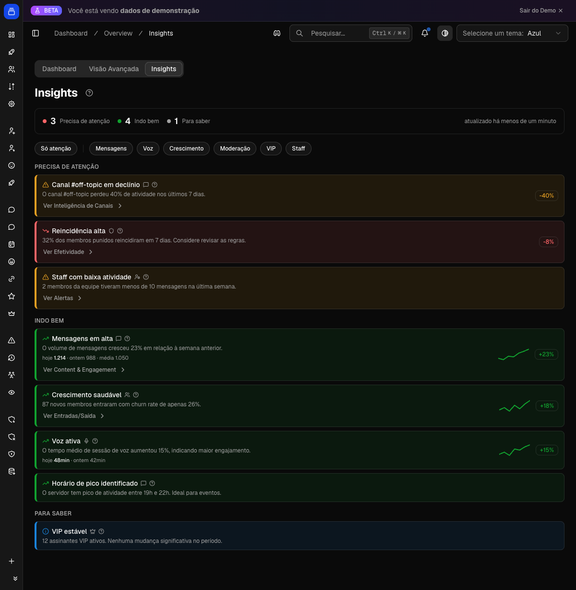

# Análise e insights

O Delfus observa a atividade do seu servidor o tempo todo — mensagens, entradas e saídas de membros, tempo em call de voz e uso de emojis — e transforma tudo em gráficos, rankings e estatísticas que você consulta tanto pelo Discord quanto pelo painel web. É a forma mais rápida de entender quem participa, quais canais bombam, em que horários o servidor fica mais movimentado e quais emojis viraram parte da cultura da comunidade.

{ .dx-shot loading=lazy }

*Insights do servidor no [Dashboard](https://admin.delfus.app) — exemplo com dados de demonstração.*

## Como funciona

O bot trabalha em segundo plano coletando dados de atividade e os consolida em pequenos intervalos. Quando você pede uma estatística, ele apenas lê o que já foi consolidado e responde — por isso a resposta é praticamente instantânea, com um atraso de poucos minutos em relação ao que acabou de acontecer.

### 1. Coleta contínua em segundo plano

Conforme o servidor é usado, o bot vai registrando diferentes tipos de atividade:

- **Mensagens.** Cada mensagem enviada incrementa um contador associado ao canal, ao autor e à hora em que foi enviada. É isso que alimenta os gráficos de canal, os tops de membros e canais mais ativos e o total de mensagens.
- **Entradas e saídas de membros.** Toda vez que alguém entra ou sai do servidor, o evento é guardado com a data e a hora. É a base do gráfico de membros (`/grafico membros`).
- **Tempo em voz.** Quando alguém entra e depois sai de um canal de voz, o bot calcula quanto tempo a pessoa ficou e soma essa duração. Isso aparece como horas de voz no overview.
- **Emojis.** Cada emoji usado é contado, separando duas situações: emoji escrito **dentro de uma mensagem** e emoji usado como **reação**. O bot reconhece tanto os emojis personalizados do servidor (incluindo os animados) quanto emojis padrão do Discord, e marca quando um emoji personalizado é **externo** (de outro servidor). Um mesmo emoji repetido na mesma mensagem conta só uma vez por mensagem.
- **Perfis de usuário.** Nome, apelido e foto dos membros são atualizados de tempos em tempos, para que rankings e telas mostrem dados atuais em vez de informações antigas.

### 2. Acúmulo em memória (para não sobrecarregar o banco)

Em um servidor ativo, gravar cada mensagem ou cada emoji individualmente no banco de dados seria pesado demais. Em vez disso, o bot **acumula essas contagens na memória**, agrupadas por hora, canal, usuário e emoji. Assim, mil mensagens em um canal numa mesma hora viram um único número a ser gravado, não mil gravações.

### 3. Gravação periódica (cerca de uma vez por minuto)

A cada minuto, o bot descarrega no banco tudo o que acumulou: contagens de mensagens e de emojis são consolidadas em lote. As atualizações de perfil seguem um ritmo próprio (são gravadas em lotes a cada poucos minutos, e cada perfil é atualizado no máximo uma vez por dia para evitar trabalho repetido). O efeito prático: **as estatísticas refletem a atividade quase em tempo real**, com um pequeno atraso de poucos minutos. Uma mensagem ou um emoji recém-usado pode levar um instante até aparecer nos rankings.

### 4. Consulta pelo Discord

Quando você roda um comando de estatística, o bot lê os dados já consolidados e responde:

- **Gráficos (`/grafico`)** são gerados como uma **imagem** com a identidade do servidor (nome e ícone), mostrando linhas de evolução, áreas preenchidas e os destaques do período.
- Logo abaixo da imagem aparecem **botões interativos**:
    - **Reload (🔄)** — regenera o gráfico com os dados mais recentes, na mesma mensagem.
    - **Período (🕐)** — abre as opções **1 dia**, **7 dias** e **30 dias**; ao escolher uma, o gráfico é refeito para aquela janela de tempo, também na mesma mensagem.
- O **overview** (`/grafico overview`) é sempre fixo nos **últimos 30 dias** e, por isso, tem apenas o botão **Reload** (não tem seleção de período).
- O **`/guildstats`** e o **`/emoji-stats`** respondem com mensagens em **embed**, e suas respostas são **privadas** (só você vê), enquanto os gráficos do `/grafico` ficam visíveis para o canal.

### 5. Janelas de tempo e detalhes de cada gráfico

- **`/grafico membros`** e **`/grafico canal`** começam mostrando os **últimos 7 dias** e podem ser trocados para 1 ou 30 dias pelo botão de período. Quando você escolhe **1 dia**, o gráfico passa a ser detalhado **hora a hora**; em 7 ou 30 dias, ele agrupa por **dia**.
- **`/grafico overview`** sempre cobre **30 dias**. Ele mostra o total de mensagens e horas de voz em recortes de 1, 7, 14 e 30 dias, além dos **top 3 membros** e **top 3 canais** por número de mensagens nesse período.
- Se ainda não houver dados para a janela escolhida (servidor novo, canal sem mensagens recentes etc.), o bot responde avisando que não há dados para o período em vez de mostrar um gráfico vazio.

### 6. Como os emojis são analisados

- **`/emoji-stats top`** lista os emojis com mais usos somados (mensagens + reações), do mais usado para o menos usado. Cada linha mostra o total e a quebra entre **💬 mensagens** e **👍 reações**. Emojis personalizados de **outros servidores** ganham o marcador **🔗 (externo)**.
- **`/emoji-stats sem-uso`** compara a lista completa de emojis do servidor com os que já foram registrados em uso e mostra exatamente quais **nunca foram usados**, com o atalho `:nome:` de cada um. Útil para decidir o que remover.
- **`/emoji-stats nomes-estranhos`** aponta emojis do servidor com nomes pouco descritivos, segundo regras automáticas: nomes só com números, muito curtos (1–2 caracteres), com excesso de underscores, ou genéricos como `emoji`, `image`, `unknown`, `untitled`, `img`, `sticker`. Ajuda numa faxina de nomenclatura.

### 7. Consulta pelo painel web

Os mesmos dados coletados alimentam as telas de visão geral, insights e emojis do [Dashboard](https://admin.delfus.app), onde você navega por tudo sem precisar abrir o Discord.

## Comandos

| Comando | O que faz |
| --- | --- |
| `/grafico overview` | Visão geral do servidor (últimos 30 dias): total de mensagens, horas de voz, top 3 membros e top 3 canais por mensagens. Imagem com botão **Reload**. |
| `/grafico membros` | Gráfico de evolução de entradas, saídas e total de membros. Começa em 7 dias; trocável para 1 ou 30 dias. |
| `/grafico canal` | Gráfico de mensagens de um canal específico (escolhido por autocomplete). Começa em 7 dias; trocável para 1 ou 30 dias. |
| `/guildstats` | Resumo do servidor: ID, data de criação, dono, total de membros e online, contagem de canais (total, texto e voz) e banner. Resposta privada. |
| `/emoji-stats top` | Ranking dos emojis mais usados, com quebra entre mensagens e reações e marcação de emojis externos. Aceita a opção `limite` (1 a 50, padrão 25). |
| `/emoji-stats sem-uso` | Lista os emojis do servidor que nunca foram usados. |
| `/emoji-stats nomes-estranhos` | Lista os emojis do servidor com nomes pouco descritivos (números, muito curtos, genéricos etc.). |

## Configuração

Não há nada a ativar: a coleta de estatísticas roda sozinha assim que o bot entra no servidor. A configuração se resume a **como você consulta** os dados:

- **Pelo Discord**, com os comandos `/grafico`, `/guildstats` e `/emoji-stats`.
- **Pelo Dashboard** em [admin.delfus.app](https://admin.delfus.app), nas telas de visão geral, insights e emojis, que apresentam os mesmos números de forma navegável.

### Opções dos comandos

- **`/grafico canal` → opção `canal`** (obrigatória): o canal de texto a analisar. O bot oferece autocompletar com os canais do servidor enquanto você digita.
- **`/emoji-stats top` → opção `limite`** (opcional): quantos emojis listar no ranking, de **1 a 50**. O padrão é **25**.
- **Botões dos gráficos**: **Reload** (atualiza) e **Período** (alterna entre 1 dia, 7 dias e 30 dias). O overview tem só o Reload, pois é fixo em 30 dias.

## Exemplos de uso

- **Ver a saúde geral do servidor de um relance:** rode `/grafico overview`. Você recebe uma imagem com mensagens e voz dos últimos 30 dias e os pódios de membros e canais mais ativos. Clique em **Reload** depois de um pico de atividade para atualizar os números.
- **Investigar crescimento ou perda de membros:** use `/grafico membros`, comece nos 7 dias e clique em **Período → 30 dias** para enxergar a tendência do mês — picos de entradas após uma divulgação ou ondas de saídas, por exemplo.
- **Fazer faxina nos emojis:** rode `/emoji-stats sem-uso` para descobrir quais emojis ninguém usa e `/emoji-stats nomes-estranhos` para achar nomes ruins. Cruze com `/emoji-stats top` para confirmar quais valem a pena manter antes de remover.

## Requisitos

- Os comandos `/grafico`, `/guildstats` e `/emoji-stats` só funcionam **dentro de um servidor** (não em DM).
- **`/emoji-stats` exige a permissão Gerenciar Servidor** para ser usado.
- O **`/emoji-stats top` tem um pequeno limite de uso** (uma chamada a cada poucos segundos) para evitar spam do comando.
- Como as estatísticas dependem de dados acumulados ao longo do tempo, um **servidor recém-adicionado pode mostrar pouca ou nenhuma informação** até o bot juntar atividade suficiente.

## Perguntas frequentes

**Por que minha última mensagem (ou emoji) ainda não aparece no ranking?**
Porque o bot consolida a atividade aproximadamente uma vez por minuto, e o ranking de emojis pode levar mais alguns instantes. Espere um pouco e use o botão **Reload** do gráfico, ou rode o comando de novo.

**O gráfico de membros mostra "sem dados". O que houve?**
Ainda não há entradas/saídas registradas para a janela escolhida — comum em servidores novos ou em períodos curtos sem movimentação. Troque o período para 30 dias pelo botão **Período** ou aguarde mais atividade.

**Qual a diferença entre um emoji externo e um do servidor no `/emoji-stats top`?**
Emojis com o marcador **🔗** são personalizados de **outros servidores** que foram usados aqui (por membros com Nitro, por exemplo). Eles entram no ranking de uso, mas não fazem parte da lista de emojis do seu servidor — por isso nunca aparecem em `sem-uso` nem em `nomes-estranhos`.

**As respostas de `/emoji-stats` e `/guildstats` aparecem para todos?**
Não. Elas são privadas — apenas quem rodou o comando vê. Já os gráficos do `/grafico` ficam visíveis no canal.

!!! tip "Dica"
    Para acompanhar um pico de atividade ao vivo (uma divulgação ou um evento), deixe o `/grafico overview` aberto e vá clicando em **Reload** a cada poucos minutos: como o bot consolida os dados quase em tempo real, você vê mensagens e horas de voz subindo sem precisar rodar o comando de novo.
