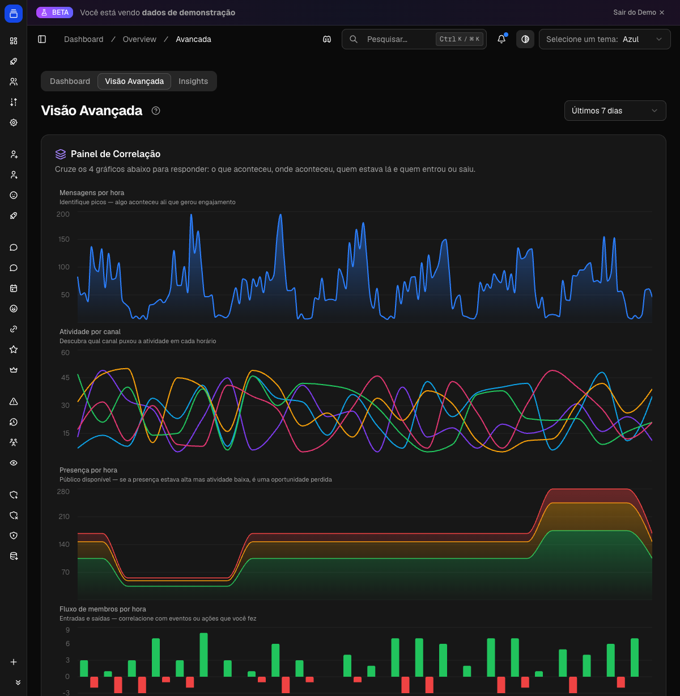
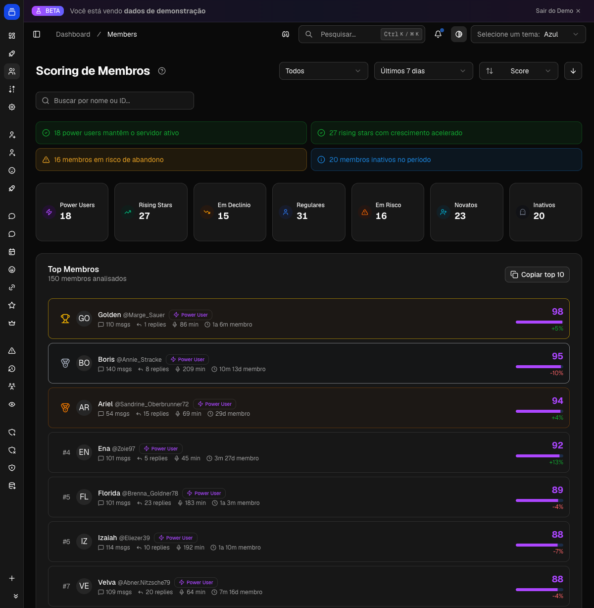

# Análise e insights

Quer saber quem mais participa do seu servidor, quais canais bombam e em que horário a galera aparece? O Delfus observa tudo isso em segundo plano — mensagens, entradas e saídas de membros, tempo em call e uso de emojis — e transforma em gráficos, rankings e estatísticas que você consulta pelo Discord ou pelo painel web.

{ .dx-shot loading=lazy }

*Insights do servidor no [Dashboard](https://admin.delfus.app) — exemplo com dados de demonstração.*

## Como funciona

O bot fica de olho na atividade do servidor o tempo todo e vai juntando os números em segundo plano. Quando você pede uma estatística, ele só lê o que já está pronto e responde na hora — por isso a resposta é praticamente instantânea, com um atraso de poucos minutos em relação ao que acabou de acontecer.

O que ele acompanha:

- **Mensagens** — quem mandou, em qual canal e em que hora. É o que alimenta os tops de membros e canais.
- **Entradas e saídas** — cada vez que alguém entra ou sai, vira ponto no gráfico de membros.
- **Tempo em call** — quanto tempo cada pessoa passou em canais de voz, somado em horas.
- **Emojis** — quantas vezes cada um aparece, separando os usados **dentro de mensagens** dos usados como **reação**. Ele reconhece os emojis do servidor (até os animados) e os padrão do Discord, e marca quando um emoji veio **de outro servidor**.
- **Perfis** — nome, apelido e foto dos membros, atualizados de tempos em tempos pra os rankings mostrarem dados atuais.

Para não pesar no banco de dados, o bot **acumula essas contagens na memória** e grava tudo em lote mais ou menos uma vez por minuto. Na prática, os números refletem a atividade quase ao vivo — só pode levar um instante até uma mensagem ou emoji recém-usado aparecer no ranking.

!!! example "Exemplo"
    Você divulgou o servidor e a galera começou a chegar. Rode `/grafico membros` e veja a linha de entradas subindo quase em tempo real. Um clique em **Reload** depois de uns minutos já mostra os novos membros que acabaram de entrar.

Os gráficos do `/grafico` saem como **imagem** com o nome e o ícone do seu servidor, e vêm com dois botões logo abaixo:

- **Reload (🔄)** — refaz o gráfico com os dados mais recentes, na mesma mensagem.
- **Período (🕐)** — alterna entre **1 dia**, **7 dias** e **30 dias**. Em 1 dia o gráfico fica detalhado **hora a hora**; em 7 ou 30 dias, ele agrupa **por dia**.

O `/grafico overview` é a exceção: ele é sempre fixo nos **últimos 30 dias**, então só tem o botão **Reload**.

!!! note "Servidor novo? Pouca coisa pra mostrar"
    As estatísticas dependem de atividade acumulada ao longo do tempo. Num servidor recém-adicionado (ou numa janela curta sem movimento), o bot pode avisar que **não há dados pro período** em vez de mostrar um gráfico vazio. Troque pra 30 dias ou espere o servidor juntar mais atividade.

## Comandos

| Comando | O que faz |
| --- | --- |
| `/grafico overview` | Visão geral dos últimos 30 dias: total de mensagens, horas de voz, top 3 membros e top 3 canais. Imagem com botão **Reload**. |
| `/grafico membros` | Evolução de entradas, saídas e total de membros. Começa em 7 dias; trocável para 1 ou 30 dias. |
| `/grafico canal` | Mensagens de um canal específico (escolhido por autocomplete). Começa em 7 dias; trocável para 1 ou 30 dias. |
| `/guildstats` | Resumo do servidor: ID, data de criação, dono, membros, online, contagem de canais e banner. Resposta privada. |
| `/emoji-stats top` | Ranking dos emojis mais usados, com quebra entre mensagens e reações e marca de emojis externos. Opção `limite` (1 a 50, padrão 25). |
| `/emoji-stats sem-uso` | Lista os emojis do servidor que nunca foram usados. |
| `/emoji-stats nomes-estranhos` | Lista emojis com nomes pouco descritivos (números, muito curtos, genéricos etc.). |

!!! note "Privado vs. público"
    As respostas de `/guildstats` e `/emoji-stats` são **privadas** — só você vê. Já os gráficos do `/grafico` ficam visíveis no canal pra todo mundo.

## Configuração

Boa notícia: não tem nada pra ativar. A coleta roda sozinha assim que o Delfus entra no servidor. O que você decide é só **onde consultar**:

- **No Discord**, com `/grafico`, `/guildstats` e `/emoji-stats`.
- **No [Dashboard](https://admin.delfus.app)**, nas telas de visão geral, insights e emojis — os mesmos números, mas navegáveis sem abrir o Discord.

Alguns detalhes úteis das opções:

- **`/grafico canal`** pede o **canal** a analisar — o bot autocompleta enquanto você digita.
- **`/emoji-stats top`** aceita um **limite** de quantos emojis listar, de 1 a 50 (padrão 25).
- Os comandos `/grafico`, `/guildstats` e `/emoji-stats` só funcionam **dentro de um servidor**, não em DM. E o `/emoji-stats` exige a permissão **Gerenciar Servidor**.

## Exemplos

!!! example "Saúde do servidor de relance"
    Rode `/grafico overview`. Em uma imagem você vê mensagens e horas de voz dos últimos 30 dias, mais os pódios dos membros e canais mais ativos. Depois de um pico de atividade, é só clicar em **Reload** pra atualizar os números.

!!! example "Cresceu ou perdeu membros?"
    Use `/grafico membros`, comece nos 7 dias e clique em **Período → 30 dias** pra enxergar a tendência do mês. Dá pra ver um pico de entradas depois de uma divulgação — ou uma onda de saídas que merece atenção.

!!! example "Faxina nos emojis"
    Rode `/emoji-stats sem-uso` pra descobrir quais emojis ninguém usa e `/emoji-stats nomes-estranhos` pra achar os de nome ruim. Cruze com `/emoji-stats top` pra confirmar quais valem a pena manter antes de remover.

## Veja na prática

Tudo no [Dashboard](https://admin.delfus.app), atualizado continuamente:

{ .dx-shot loading=lazy }

*Visão avançada — mensagens, atividade por canal e presença ao longo do tempo (dados de demonstração).*

{ .dx-shot loading=lazy }

*Lista de membros com pontuação e atividade — dados de demonstração.*

## Perguntas frequentes

**Minha última mensagem (ou emoji) ainda não apareceu no ranking. Normal?**
Sim. O bot consolida a atividade mais ou menos uma vez por minuto, e o ranking de emojis pode levar mais alguns instantes. Espere um pouco e clique em **Reload**, ou rode o comando de novo.

**O gráfico de membros diz "sem dados". O que houve?**
Ainda não há entradas ou saídas registradas na janela escolhida — comum em servidor novo ou em períodos curtos e parados. Troque pra 30 dias no botão **Período** ou aguarde mais movimento.

**O que significa o marcador 🔗 no `/emoji-stats top`?**
É um emoji personalizado de **outro servidor** que foi usado aqui (por alguém com Nitro, por exemplo). Ele entra no ranking de uso, mas não faz parte da lista do seu servidor — por isso nunca aparece em `sem-uso` nem em `nomes-estranhos`.

**O `/emoji-stats top` não respondeu de primeira. Por quê?**
Esse comando tem um pequeno limite de uso (uma chamada a cada poucos segundos) pra evitar spam. Espere uns segundos e tente de novo.

!!! tip "Dica"
    Quer acompanhar um pico ao vivo, tipo uma divulgação ou evento? Deixe o `/grafico overview` aberto e vá clicando em **Reload** a cada poucos minutos. Como o bot consolida os dados quase em tempo real, você vê mensagens e horas de voz subindo sem precisar rodar o comando de novo.

