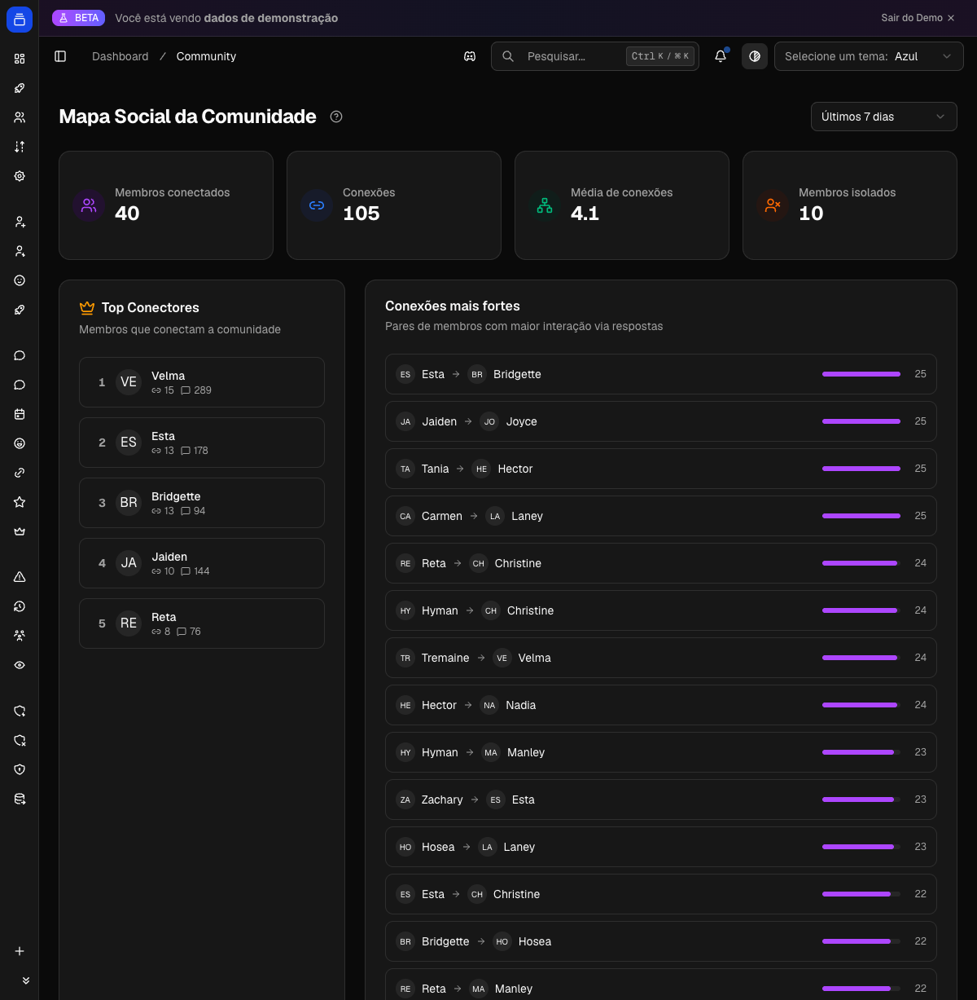

Reescrevi a página `/Users/goulart/workspace/delfus/delfus-docs/docs/funcionalidades/analise.md` mantendo tudo o que já existia e adicionando cinco seções novas, todas fundamentadas no código das rotas `src/app/api/dashboard/*` do front-end e nos coletores/jobs do bot.

## O que mudei

Mantive intactas a intro, `## Como funciona` (1ª seção), `## Comandos`, `## Configuração`, `## Exemplos`, `## Veja na prática` e `## Veja na prática

O mapa social mostra como os membros interagem entre si:

{ .dx-shot loading=lazy }

*Mapa social no painel — dados de demonstração.*

## Perguntas frequentes`. Adicionei uma linha de "presença" em "Como funciona" (o snapshot horário) para dar base à nova seção de fluxo.

Inseri cinco seções entre "Como funciona" e "Comandos":

- **## Pontuação de membros** — nota 0–100 e 7 categorias (Power User, Rising Star, Em Declínio, Regular, Em Risco, Novato, Inativo). Fundamentado em `features/members/scoring.ts` (`calculateMemberScore`: mensagens, voz, replies, bônus de tendência; thresholds de categoria) e na rota `member-scoring/route.ts` (filtros, busca, ordenação, contagem por categoria, destaques automáticos).
- **## Fluxo de membros** — entradas/saídas/presença. Fundamentado em `member-flow/route.ts`: resumo (crescimento líquido, churn, médias, dias de pico), timeline por dia/hora, e presença a partir dos snapshots (`discordPresenceSnapshot`). Incluí o note sobre estimativa em servidores grandes, que vem do `presence-snapshot-job.ts` (`PRESENCE_FULL_FETCH_LIMIT`, schedule horário `0 0 * * * *`).
- **## Mapa social** — rede de respostas. Fundamentado em `social-graph/route.ts`: arestas só com peso ≥ 2, categorias connector/active/peripheral/isolated, stats e top conectores.
- **## Inteligência de canais** — nota de saúde 0–100 por canal, comparando período atual vs. anterior. Fundamentado em `channels/route.ts`: rótulos (Muito Ativo → Inativo), tendência, dias desde última atividade, sugestões de arquivar/mesclar.
- **## Conteúdo & engajamento** — fundamentado em `content-analytics/route.ts`: resumo (taxa de resposta, taxa de anexo, tamanho médio), tipos de conteúdo, engajamento por canal e por hora, top contribuidores.

## Decisões

- Cada seção segue o pedido: o que é (frase de abertura pelo ganho do usuário), como funciona, o que o usuário vê.
- Deixei explícito na tabela de comandos e no FAQ que essas cinco telas vivem só no Dashboard, não em slash command — confirmado pelo `nav-config.ts` (rotas `/dashboard/member-flow`, `/community`, `/channels`, `/content`) e por não existir comando correspondente no bot.
- Usei os rótulos de UI reais do `nav-config.ts`: "Mapa Social", "Inteligência de Canais", "Conteúdo & Engajamento".
- Atualizei "Configuração" e "Exemplos" para citar as telas novas; adicionei 3 entradas no FAQ (cálculo da nota, por que o mapa social não mostra todo mundo, por que a presença diverge do número atual).

Não inseri imagens. Não inventei comandos nem campos: tudo veio das rotas e do código do bot.

