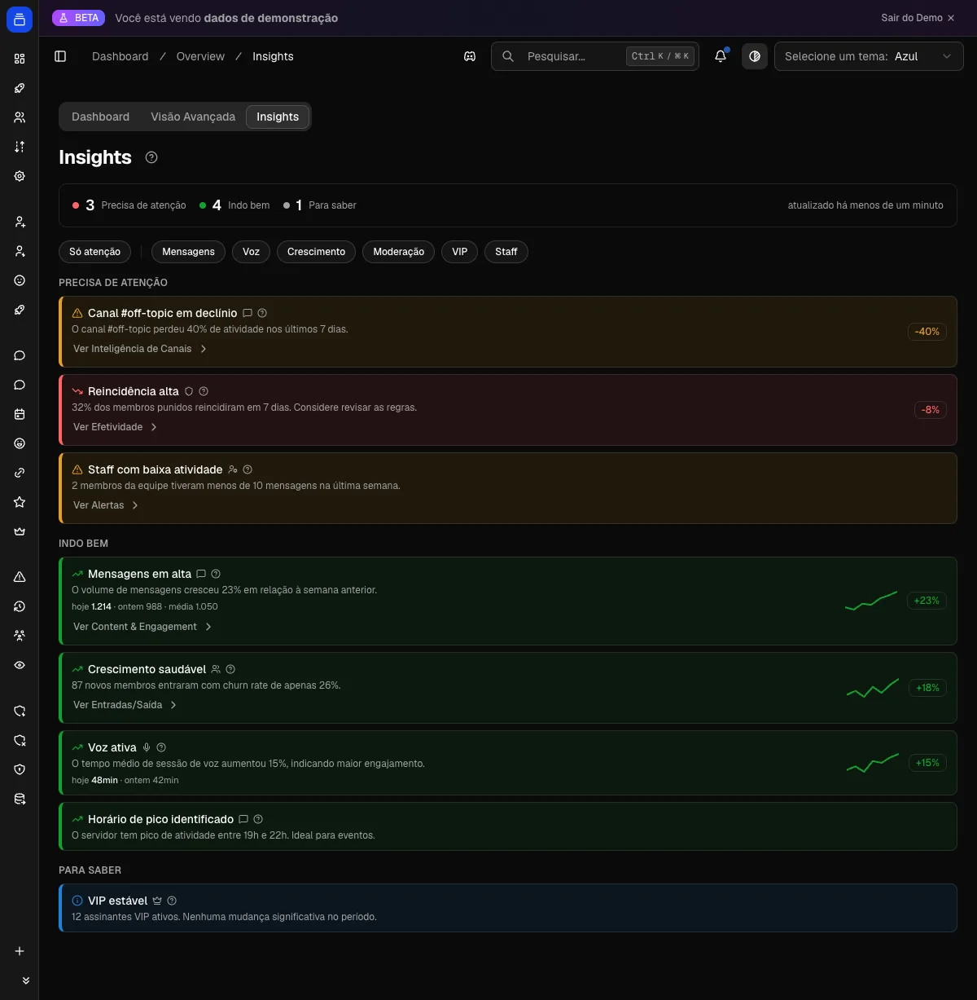
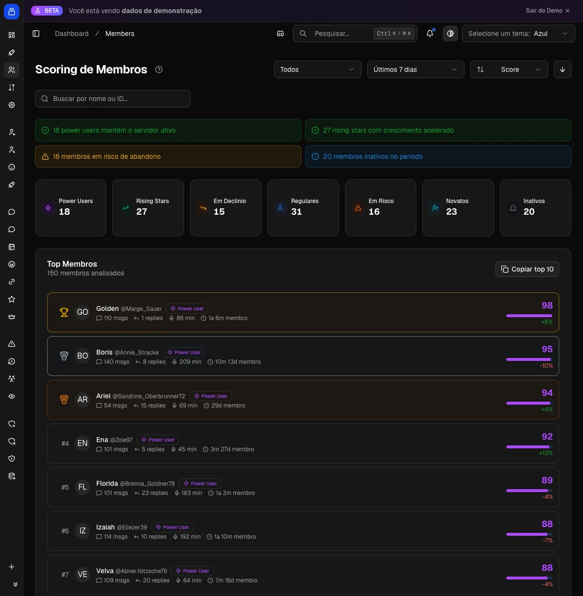
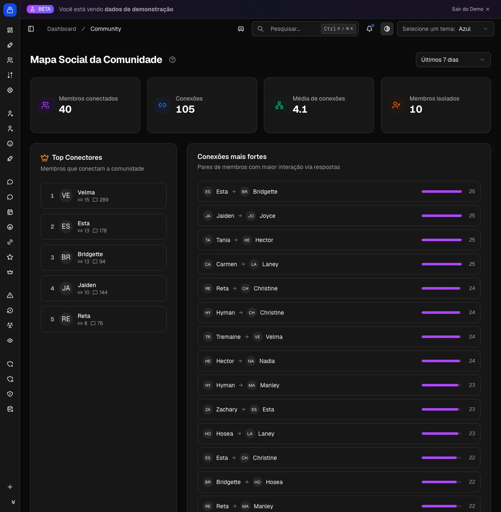
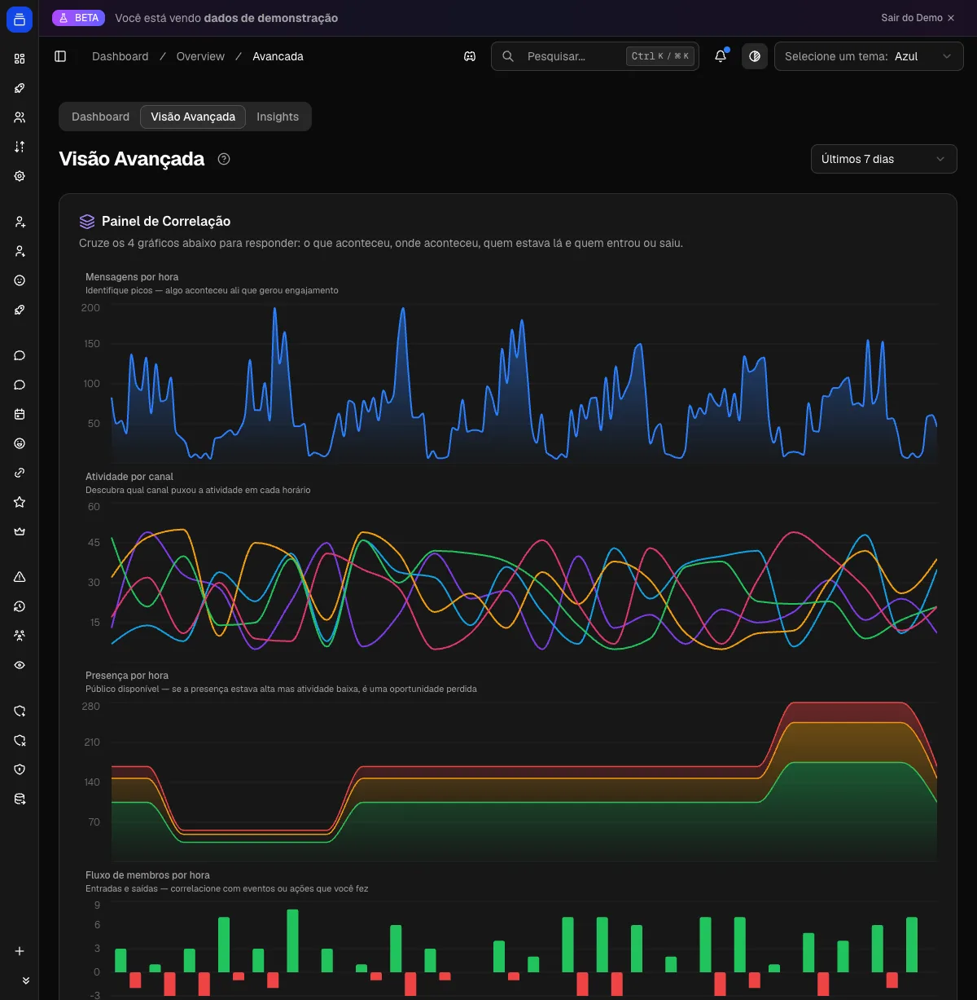

# Análise e insights

Saiba quem mais participa, quais canais bombam e em que horário a galera aparece. O Delfus observa mensagens, entradas e saídas de membros, tempo em call e uso de emojis, e transforma tudo em gráficos, rankings e estatísticas que você consulta pelo Discord ou pelo painel web.

{ .dx-shot width="1200" height="1227" fetchpriority=high }

*Insights do servidor no [Dashboard](https://admin.delfus.app) (exemplo com dados de demonstração).*

## Como funciona

O bot acompanha a atividade do servidor o tempo todo e vai juntando os números em segundo plano. Quando você pede uma estatística, ele lê o que já está pronto e responde na hora. A resposta é quase instantânea, com poucos minutos de atraso em relação ao que acabou de acontecer.

O que ele acompanha:

- **Mensagens**: quem mandou, em qual canal e em que hora. Alimenta os tops de membros e canais.
- **Entradas e saídas**: cada entrada ou saída vira ponto no gráfico de membros.
- **Tempo em call**: quanto tempo cada pessoa passou em canais de voz, somado em horas.
- **Emojis**: quantas vezes cada um aparece, separando os usados dentro de mensagens dos usados como reação. Reconhece os emojis do servidor (até animados) e os padrão do Discord, e marca quando um emoji veio de outro servidor.
- **Perfis**: nome, apelido e foto dos membros, atualizados de tempos em tempos para os rankings mostrarem dados atuais.

Para não pesar no banco, o bot acumula essas contagens na memória e grava tudo em lote mais ou menos uma vez por minuto. Os números refletem a atividade quase ao vivo. Só pode levar um instante até uma mensagem ou emoji recém-usado aparecer no ranking.

!!! example "Exemplo"
    Você divulgou o servidor e a galera começou a chegar. Rode `/grafico membros` e veja a linha de entradas subindo quase em tempo real. Um clique em **Reload** depois de uns minutos já mostra os novos membros.

Os gráficos do `/grafico` saem como imagem com o nome e o ícone do seu servidor, e vêm com dois botões logo abaixo:

- **Reload (🔄)**: refaz o gráfico com os dados mais recentes, na mesma mensagem.
- **Período (🕐)**: alterna entre 1 dia, 7 dias e 30 dias. Em 1 dia o gráfico fica detalhado hora a hora; em 7 ou 30 dias, agrupa por dia.

O `/grafico overview` é a exceção: fica sempre fixo nos últimos 30 dias, então só tem o botão **Reload**.

!!! note "Servidor novo? Pouca coisa para mostrar"
    As estatísticas dependem de atividade acumulada ao longo do tempo. Num servidor recém-adicionado (ou numa janela curta sem movimento), o bot pode avisar que não há dados para o período em vez de mostrar um gráfico vazio. Troque para 30 dias ou espere o servidor juntar mais atividade.

## Comandos

| Comando | O que faz |
| --- | --- |
| `/grafico overview` | Visão geral dos últimos 30 dias: total de mensagens, horas de voz, top 3 membros e top 3 canais. Imagem com botão **Reload**. |
| `/grafico membros` | Evolução de entradas, saídas e total de membros. Começa em 7 dias; trocável para 1 ou 30 dias. |
| `/grafico canal` | Mensagens de um canal específico (escolhido por autocomplete). Começa em 7 dias; trocável para 1 ou 30 dias. |
| `/guildstats` | Resumo do servidor: ID, data de criação, dono, membros, online, contagem de canais e banner. Resposta privada. |
| `/emoji-stats top` | Ranking dos emojis mais usados, com quebra entre mensagens e reações e marca de emojis externos. Opção `limite` (1 a 50, padrão 25). |
| `/emoji-stats sem-uso` | Lista os emojis do servidor que nunca foram usados. |
| `/emoji-stats nomes-estranhos` | Lista emojis com nomes pouco descritivos (números, muito curtos, genéricos etc.). |

!!! note "Privado vs. público"
    As respostas de `/guildstats` e `/emoji-stats` são privadas: só você vê. Já os gráficos do `/grafico` ficam visíveis no canal para todo mundo.

## Configuração

Não tem nada para ativar. A coleta roda sozinha assim que o Delfus entra no servidor. Você só decide onde consultar:

- **No Discord**, com `/grafico`, `/guildstats` e `/emoji-stats`.
- **No [Dashboard](https://admin.delfus.app)**, nas telas de visão geral, insights e emojis. Os mesmos números, navegáveis sem abrir o Discord.

Detalhes úteis das opções:

- **`/grafico canal`** pede o canal a analisar. O bot autocompleta enquanto você digita.
- **`/emoji-stats top`** aceita um limite de quantos emojis listar, de 1 a 50 (padrão 25).
- `/grafico`, `/guildstats` e `/emoji-stats` só funcionam dentro de um servidor, não em DM. E o `/emoji-stats` exige a permissão **Gerenciar Servidor**.

## Exemplos

!!! example "Saúde do servidor de relance"
    Rode `/grafico overview`. Numa imagem você vê mensagens e horas de voz dos últimos 30 dias, mais os pódios dos membros e canais mais ativos. Depois de um pico de atividade, clique em **Reload** para atualizar os números.

!!! example "Cresceu ou perdeu membros?"
    Use `/grafico membros`, comece nos 7 dias e clique em **Período → 30 dias** para ver a tendência do mês. Dá para identificar um pico de entradas depois de uma divulgação, ou uma onda de saídas que merece atenção.

!!! example "Faxina nos emojis"
    Rode `/emoji-stats sem-uso` para descobrir quais emojis ninguém usa e `/emoji-stats nomes-estranhos` para achar os de nome ruim. Cruze com `/emoji-stats top` para confirmar quais valem a pena manter antes de remover.

## Análises no painel

Os comandos respondem rápido no Discord; o [Dashboard](https://admin.delfus.app) vai mais fundo. As telas de análise ficam em dois lugares:

- **Hub de análises** (entre pelo *Resumo*): abas **Dashboard**, **Visão Avançada**, **Insights**, **Fluxo de Membros**, **Retenção** e **Pontuação**.
- **Oráculo** (grupo *Operação* na barra lateral): abas **Mapa Social**, **Canais** e **Conteúdo**.

As análises do Oráculo dependem de você escolher quais canais ele monitora — pelo comando `/oráculo <canal>` no Discord ou pelo botão **Configurar** na própria tela. Sem isso, essas três abas mostram um aviso de configuração pendente.

### Pontuação de membros

{ .dx-shot width="1200" height="1227" loading=lazy }

*Pontuação de membros no [Dashboard](https://admin.delfus.app) (dados de demonstração).*

Cada membro recebe uma nota de 0 a 100 que resume o quanto ele participa. A conta soma quatro fatores: mensagens enviadas (até 40 pontos), tempo em call (até 30), respostas a outros membros (até 15) e um bônus de tendência (15) para quem acelerou em relação ao período anterior.

A nota classifica cada um em categorias que você usa como filtro: **Power Users**, **Rising Stars**, **Em Declínio**, **Regulares**, **Em Risco** (era ativo e parou de repente), **Novatos** (menos de 14 dias de servidor) e **Inativos**. Os destaques no topo da tela avisam quando algo pede atenção — membros em risco de saída, novatos que já chegaram participando.

Dá para trocar o período (de 24 horas a 90 dias, ou um intervalo personalizado), ordenar por score, mensagens, voz, replies ou tendência, e copiar o top 10 já no formato de menção pra colar num anúncio no Discord. Clicar num membro abre o perfil individual dele: score, top canais, horários em que costuma aparecer, punições e parceiros de conversa. A aba **Retenção** complementa: mostra quantos novatos de cada leva participaram e quantos ficaram após 1, 7 e 30 dias.

### Fluxo de membros

A aba **Fluxo de Membros** responde se o servidor está crescendo ou encolhendo no período escolhido: entradas, saídas, saldo e churn (a proporção de saídas sobre entradas). A timeline mostra as três curvas por dia ou por hora e marca os picos — útil pra ligar uma onda de entradas a uma divulgação, ou uma fuga a algum incidente.

A mesma tela acompanha a **presença**: quantos membros ficam online, ausentes ou em não perturbe ao longo do período, com a taxa de atividade e o horário de pico.

### Mapa social

{ .dx-shot width="1200" height="1227" loading=lazy }

*Mapa social no [Dashboard](https://admin.delfus.app) (dados de demonstração).*

O mapa social enxerga o servidor como uma rede: quem responde quem. Ele conta as conexões formadas por respostas entre membros e mostra quantos estão conectados, quantos estão isolados e quais pares conversam mais.

Os **Top Conectores** são as pessoas que ligam a comunidade — se elas saírem, grupos inteiros se desligam; vale cuidar delas. A distribuição da rede separa os membros em **Conectores**, **Ativos**, **Periféricos** e **Isolados**, e a lista de conexões mais fortes revela as duplas que sustentam o papo.

### Inteligência de canais

A aba **Canais** dá uma nota de saúde de 0 a 100 pra cada canal monitorado, combinando volume de mensagens, quantidade de pessoas diferentes participando e tendência. Os rótulos vão de **Muito Ativo** a **Inativo**, e o ranking ordena do mais saudável ao mais parado.

Quando há canais definhando, a tela sugere ação: arquivar ou mesclar os de baixíssima atividade, revisar o conteúdo dos que estão em declínio.

### Conteúdo & engajamento

A aba **Conteúdo** mostra do que as conversas são feitas: proporção de texto puro, anexos, embeds, stickers e respostas, além da taxa de resposta por canal (quanto do papo gera conversa de verdade, não só mensagens soltas), os top contribuidores do período e o engajamento hora a hora.

### Visão avançada

{ .dx-shot width="1200" height="1227" loading=lazy }

*Visão avançada no [Dashboard](https://admin.delfus.app) (dados de demonstração).*

A **Visão Avançada** cruza quatro gráficos na mesma linha do tempo — mensagens por hora, atividade por canal, presença e fluxo de membros — pra responder de uma vez: o que aconteceu, onde, quem estava lá e quem entrou ou saiu. Passe o mouse num horário e os quatro se alinham.

No fim da tela, os **insights estratégicos** transformam esse histórico em sugestão prática: os melhores horários pra aquecer o chat, publicar um anúncio ou rodar um evento, os melhores dias da semana e o pico de voz do servidor.

## Perguntas frequentes

### O Mapa Social (ou Canais/Conteúdo) diz que o Oráculo não está configurado. E agora?
Essas análises só olham os canais que você mandou o Oráculo monitorar. Configure com `/oráculo <canal>` no Discord ou pelo botão **Configurar** na tela — a partir daí os dados começam a acumular.

### Minha última mensagem (ou emoji) ainda não apareceu no ranking. Normal?
Sim. O bot consolida a atividade mais ou menos uma vez por minuto, e o ranking de emojis pode levar mais alguns instantes. Espere um pouco e clique em **Reload**, ou rode o comando de novo.

### O gráfico de membros diz "sem dados". O que houve?
Ainda não há entradas ou saídas registradas na janela escolhida. É comum em servidor novo ou em períodos curtos e parados. Troque para 30 dias no botão **Período** ou aguarde mais movimento.

### O que significa o marcador 🔗 no `/emoji-stats top`?
É um emoji personalizado de outro servidor que foi usado aqui (por alguém com Nitro, por exemplo). Ele entra no ranking de uso, mas não faz parte da lista do seu servidor, por isso nunca aparece em `sem-uso` nem em `nomes-estranhos`.

### O `/emoji-stats top` não respondeu de primeira. Por quê?
Esse comando tem um limite de uso (uma chamada a cada poucos segundos) para evitar spam. Espere uns segundos e tente de novo.

!!! tip "Dica"
    Quer acompanhar um pico ao vivo, tipo uma divulgação ou evento? Deixe o `/grafico overview` aberto e clique em **Reload** a cada poucos minutos. Como o bot consolida os dados quase em tempo real, você vê mensagens e horas de voz subindo sem rodar o comando de novo.

Veja também: [Oráculo](oraculo.md), [Emojis](emojis.md), [Gestão de equipe](equipe.md).
