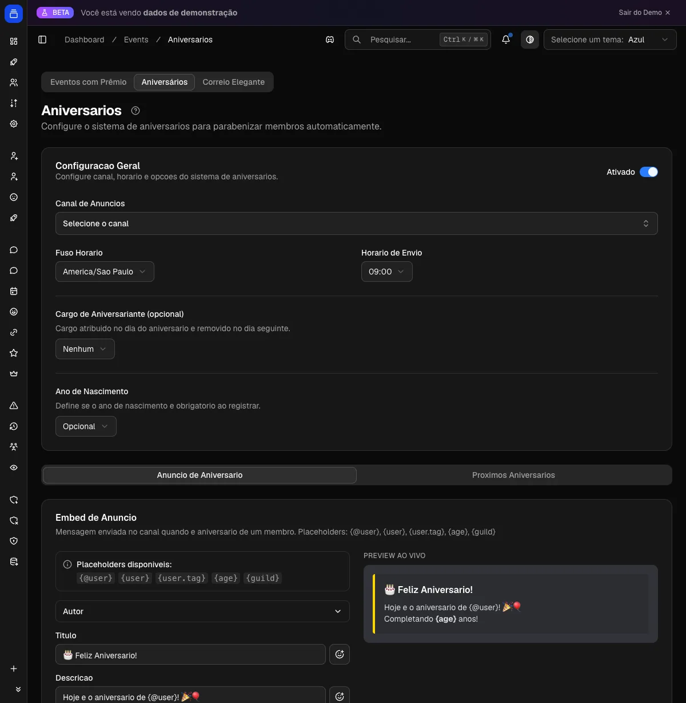

# Aniversários

Cada membro registra a própria data e o Delfus manda os parabéns sozinho, no dia certo e no canal do Discord que você escolher. Sem trabalho manual.

{ .dx-shot width="1200" height="1227" fetchpriority=high }

*Configuração de aniversários no [Dashboard](https://admin.delfus.app) (exemplo com dados de demonstração).*

## Como funciona

O membro registra a data dele. O Delfus checa de hora em hora e posta os parabéns no momento certo.

Cada pessoa usa `/aniversario registrar` informando dia e mês (e o ano, se você pedir). O bot guarda a data e, todo dia no horário que você definiu, posta uma mensagem para quem faz aniversário. Você ainda pode dar um cargo especial só para esse dia.

Tudo respeita o fuso horário do seu público. O "feliz aniversário" sai às 9h de verdade, não às 9h de um fuso aleatório.

!!! example "Exemplo"
    A Ana registra que nasceu em **15 de março**. No dia 15, às 9h (horário de Brasília), o Delfus posta no canal de avisos: "🎂 Feliz Aniversário, @Ana!" e dá a ela o cargo "Aniversariante" pelo resto do dia. No dia 16, o cargo some sozinho. A moderação não precisou fazer nada.

Detalhes que vale saber:

- **A data é por servidor.** A mesma pessoa pode ter datas diferentes em comunidades diferentes.
- **Cada um registra uma vez só.** Se tentar registrar de novo, o bot recusa. Isso evita que alguém troque a data para "ganhar" anúncio em outro dia. Para corrigir, um admin usa `/aniversario-admin definir-usuario`.
- **Sem mensagens duplicadas.** Mesmo rodando de hora em hora, os parabéns de cada dia saem uma vez.

## Comandos

| Comando | O que faz |
| --- | --- |
| `/aniversario registrar` | O membro registra o próprio aniversário (dia, mês e, se a política exigir, ano). Uma vez por servidor. |
| `/aniversario ver` | Mostra o aniversário (e a idade, se houver ano) de você ou de outro membro. |
| `/aniversario proximos` | Lista os 10 próximos aniversários do servidor, do mais perto ao mais longe. Quem faz hoje aparece como **"Hoje! 🎉"**. |
| `/aniversario-admin definir-usuario` | **(Admin)** Define ou corrige o aniversário de alguém, mesmo se a pessoa já tinha registrado. |
| `/aniversario-admin remover-usuario` | **(Admin)** Apaga o aniversário registrado de um membro. |

!!! note "Permissão"
    Os comandos `/aniversario-admin` só funcionam para quem tem **Administrador** no servidor.

## Configuração

Configure pelo **[Dashboard](https://admin.delfus.app)**, em **Eventos → Aniversários**:

1. **Ative a funcionalidade** no botão de liga/desliga (vem desligada por padrão).
2. **Canal de Anúncios:** onde os parabéns são postados. Sem canal, nada sai.
3. **Fuso Horário:** o fuso do seu público (padrão: horário de Brasília). É ele que define quando "é o dia".
4. **Horário de Envio:** a hora cheia em que os parabéns saem (padrão: **09:00**).
5. **Cargo de Aniversariante** *(opcional)*: um cargo que o bot dá no dia e tira no dia seguinte. Deixe em "Nenhum" se não quiser usar.
6. **Ano de Nascimento:** escolha a política: **Opcional**, **Obrigatório** ou **Desativado**.
7. **Personalize as mensagens:** monte a embed de parabéns e o template do `/aniversario proximos` nos editores visuais.
8. Clique em **Salvar**.

### A política do "ano de nascimento"

Esse campo decide se a idade aparece:

- **Opcional** *(padrão)*: a pessoa escolhe se informa o ano. Quem informa tem a idade mostrada; quem não informa, só a data.
- **Obrigatório:** sem ano, sem registro.
- **Desativado:** o ano é ignorado e nunca guardado. A idade nunca aparece.

### Personalizando a mensagem

Na embed de parabéns você pode usar estes marcadores, que o bot preenche sozinho:

- `{@user}`: menção do aniversariante
- `{user}`: nome dele
- `{user.tag}`: tag completa
- `{age}`: idade que está completando (só aparece se tiver ano registrado)
- `{guild}`: nome do servidor

Não montou nada? O Delfus usa um modelo padrão festivo automaticamente.

!!! warning "Permissões do bot"
    Para postar os parabéns, o bot precisa poder **enviar mensagens** e **inserir links/embeds** no canal. Para usar o cargo de aniversariante, ele precisa de **Gerenciar Cargos**, e o cargo dele tem que estar **acima** do cargo de aniversariante na hierarquia. Sem isso, ele não consegue dar nem tirar o cargo.

## Exemplos

!!! example "Celebrar todo mundo, sem expor idade"
    Defina o ano como **Desativado**, escolha um canal de avisos e o horário das 09:00. Os membros registram só dia e mês, e os parabéns saem sem mencionar idade. Bom para comunidades onde idade é assunto sensível.

!!! example "Público internacional"
    Tem gente de fora? Ajuste o **Fuso Horário** para o do seu público principal (ex.: `Europe/Lisbon`) e coloque o horário num momento de pico, tipo 18:00. Assim o "feliz aniversário" aparece quando a galera está online.

!!! example "Destacar o aniversariante do dia"
    Crie um cargo "🎉 Aniversariante", coloque ele no topo da lista de cargos para ganhar cor e destaque, e selecione em "Cargo de Aniversariante". No dia, o bot dá o cargo; no dia seguinte, tira. O cargo circula sozinho de um aniversariante para o próximo.

## Perguntas frequentes

### Por que os parabéns não saíram?
Confira três coisas: a funcionalidade está ativada? Tem um canal definido? O bot consegue enviar mensagens nele? O anúncio também respeita o **fuso** e o **horário** que você configurou, então só dispara quando a hora local bate.

### Registrei a data errada, e agora?
Você não muda sozinho depois de gravar. Peça a um admin para usar `/aniversario-admin definir-usuario` (corrige) ou `/aniversario-admin remover-usuario` (apaga, e aí você registra de novo).

### A idade vai aparecer nos parabéns?
Só se o ano estiver registrado. Com a política **Desativado**, o ano nunca é guardado e a idade nunca aparece. Com **Opcional**, aparece só para quem informou.

### Posso ter aniversários diferentes em servidores diferentes?
Pode. O registro é por servidor, então cada comunidade tem a própria lista, independente das outras.

!!! tip "Dica"
    Use a política **Opcional** ou **Obrigatório** para o ano e coloque o marcador `{age}` na embed. Assim os parabéns mostram quantos anos a pessoa está completando, e a mensagem fica mais pessoal.
