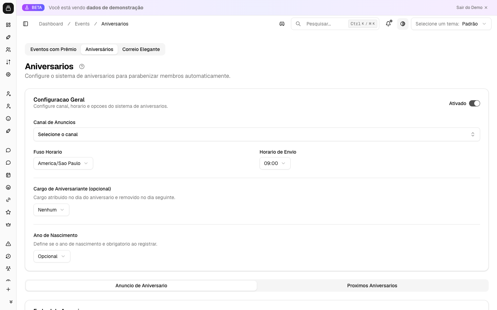

# Aniversários

Ninguém gosta de ter o aniversário esquecido — e numa comunidade grande é impossível guardar a data de todo mundo na cabeça. O Delfus resolve isso por você: cada membro registra a própria data, e no dia certo o bot manda os parabéns sozinho, no canal que você escolher. Zero trabalho manual, comunidade se sentindo lembrada.

{ .dx-shot loading=lazy }

*Configuração de aniversários no [Dashboard](https://admin.delfus.app) — exemplo com dados de demonstração.*

## Como funciona

A ideia é simples: o **membro registra a data dele**, e o Delfus faz uma **conferência automática de hora em hora** para soltar os parabéns no momento certo.

Cada pessoa usa `/aniversario registrar` informando dia e mês (e o ano, se você pedir). O bot guarda essa data e, todo dia no horário que você definiu, posta uma mensagem de parabéns para quem está fazendo aniversário. Se quiser, ainda dá pra dar um cargo especial só pra esse dia.

Tudo respeitando o **fuso horário** do seu público — então o "feliz aniversário" sai às 9h da manhã de verdade, não às 9h de um fuso aleatório.

!!! example "Exemplo"
    A Ana registra que nasceu em **15 de março**. No dia 15, às 9h (horário de Brasília), o Delfus posta no canal de avisos: "🎂 Feliz Aniversário, @Ana!" — e ainda dá pra ela o cargo "Aniversariante" pelo resto do dia. No dia 16, o cargo some sozinho. Ninguém da moderação precisou fazer nada.

Alguns detalhes que vale saber:

- **A data é por servidor.** A mesma pessoa pode ter aniversários diferentes registrados em comunidades diferentes.
- **Cada um registra uma vez só.** Se a pessoa tentar registrar de novo, o bot recusa — isso evita que alguém fique trocando a data pra "ganhar" anúncio em outro dia. Para corrigir, um admin usa `/aniversario-admin definir-usuario`.
- **Sem mensagens duplicadas.** Mesmo rodando de hora em hora, os parabéns de cada dia saem uma única vez.

## Comandos

| Comando | O que faz |
| --- | --- |
| `/aniversario registrar` | O membro registra o próprio aniversário (dia, mês e, se a política exigir, ano). Uma vez por servidor. |
| `/aniversario ver` | Mostra o aniversário (e a idade, se houver ano) de você ou de outro membro. |
| `/aniversario proximos` | Lista os 10 próximos aniversários do servidor, do mais perto ao mais longe. Quem faz hoje aparece como **"Hoje! 🎉"**. |
| `/aniversario-admin definir-usuario` | **(Admin)** Define ou corrige o aniversário de alguém — funciona mesmo se a pessoa já tinha registrado. |
| `/aniversario-admin remover-usuario` | **(Admin)** Apaga o aniversário registrado de um membro. |

!!! note "Permissão"
    Os comandos `/aniversario-admin` só funcionam para quem tem **Administrador** no servidor.

## Configuração

Tudo é feito pelo **[Dashboard](https://admin.delfus.app)**, em **Eventos → Aniversários**:

1. **Ative a funcionalidade** no botão de liga/desliga (vem desligada por padrão).
2. **Canal de Anúncios** — escolha onde os parabéns serão postados. Sem canal, nada sai.
3. **Fuso Horário** — o fuso do seu público (padrão: horário de Brasília). É ele que define quando "é o dia".
4. **Horário de Envio** — a hora cheia em que os parabéns saem (padrão: **09:00**).
5. **Cargo de Aniversariante** *(opcional)* — um cargo que o bot dá no dia e tira no dia seguinte. Deixe em "Nenhum" se não quiser usar.
6. **Ano de Nascimento** — escolha a política: **Opcional**, **Obrigatório** ou **Desativado**.
7. **Personalize as mensagens** — monte a embed de parabéns e o template do `/aniversario proximos` nos editores visuais.
8. Clique em **Salvar**.

### A política do "ano de nascimento"

Esse campo decide se a idade vai aparecer ou não:

- **Opcional** *(padrão)* — a pessoa escolhe se informa o ano. Quem informa, tem a idade mostrada; quem não informa, só a data.
- **Obrigatório** — sem ano, sem registro.
- **Desativado** — o ano é ignorado e nunca guardado. A idade nunca aparece.

### Personalizando a mensagem

Na embed de parabéns você pode usar estes marcadores, que o bot preenche sozinho:

- `{@user}` — menção do aniversariante
- `{user}` — nome dele
- `{user.tag}` — tag completa
- `{age}` — idade que está completando (só aparece se tiver ano registrado)
- `{guild}` — nome do servidor

Não montou nada? Sem problema — o Delfus usa um modelo padrão festivo automaticamente.

!!! warning "Permissões do bot"
    Para postar os parabéns, o bot precisa poder **enviar mensagens** e **inserir links/embeds** no canal. Para usar o cargo de aniversariante, ele precisa de **Gerenciar Cargos**, e o cargo dele tem que estar **acima** do cargo de aniversariante na hierarquia — senão ele não consegue dar nem tirar o cargo.

## Exemplos

!!! example "Celebrar todo mundo, sem expor idade"
    Defina o ano como **Desativado**, escolha um canal de avisos e o horário das 09:00. Os membros registram só dia e mês, e os parabéns saem sem mencionar idade nenhuma. Perfeito para comunidades onde idade é assunto sensível.

!!! example "Público internacional"
    Tem gente de fora? Ajuste o **Fuso Horário** para o do seu público principal (ex.: `Europe/Lisbon`) e coloque o horário num momento de pico, tipo 18:00. Assim o "feliz aniversário" aparece quando a galera está online de verdade.

!!! example "Destacar o aniversariante do dia"
    Crie um cargo "🎉 Aniversariante", coloque ele bem no topo da lista de cargos pra ganhar cor e destaque, e selecione em "Cargo de Aniversariante". No dia, o bot dá o cargo; no dia seguinte, tira. O cargo "circula" sozinho de um aniversariante pro próximo.

## Perguntas frequentes

**Por que os parabéns não saíram?**
Confira três coisas: a funcionalidade está ativada? Tem um canal definido? O bot consegue enviar mensagens nele? Lembre também que o anúncio respeita o **fuso** e o **horário** que você configurou — ele só dispara quando a hora local bate certinho.

**Registrei a data errada, e agora?**
Você não consegue mudar sozinho depois de gravar. Peça a um admin para usar `/aniversario-admin definir-usuario` (corrige) ou `/aniversario-admin remover-usuario` (apaga, e aí você registra de novo).

**A idade vai aparecer nos parabéns?**
Só se o ano estiver registrado. Com a política **Desativado**, o ano nunca é guardado e a idade nunca aparece. Com **Opcional**, aparece só pra quem informou.

**Posso ter aniversários diferentes em servidores diferentes?**
Pode. O registro é por servidor, então cada comunidade tem a própria lista, independente das outras.

!!! tip "Dica"
    Use a política **Opcional** ou **Obrigatório** para o ano e coloque o marcador `{age}` na embed: assim os parabéns mostram automaticamente quantos anos a pessoa está completando. A mensagem fica muito mais pessoal.

