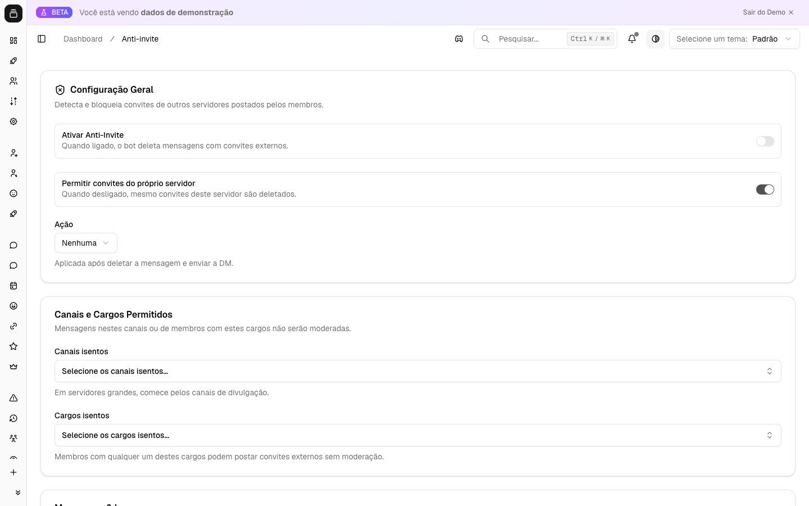

# Anti-invite

O Anti-invite remove automaticamente mensagens com convites de outros servidores do Discord (links `discord.gg` / `discord.com/invite`) e pune quem os envia, mantendo a divulgação de comunidades concorrentes fora do seu servidor. É a defesa de primeira linha contra "raids de divulgação", spam de convites e usuários que aproveitam o seu público para puxar membros para outros lugares.

A grande vantagem do módulo é que ele distingue **convites do próprio servidor** dos **convites externos**: links de convite gerados dentro do seu servidor (e a URL personalizada/vanity) podem ser permitidos, enquanto qualquer link apontando para fora é tratado como violação. Tudo acontece em tempo real, no instante em que a mensagem é enviada.

{ .dx-shot loading=lazy }

*Configuração do anti-invite no [Dashboard](https://admin.delfus.app) — exemplo com dados de demonstração.*

## Como funciona

O módulo observa **todas as mensagens enviadas por membros** (mensagens de bots são sempre ignoradas) nos servidores onde está ativado. Cada mensagem passa por uma sequência de checagens rápidas, e só vira ação se realmente houver um convite externo (ou um convite interno, caso você os tenha bloqueado).

### Passo a passo de cada mensagem

1. **Filtros de entrada.** Antes de qualquer análise, o bot descarta a mensagem se:
   - o autor for um bot;
   - o Anti-invite estiver **desligado** no servidor;
   - o canal estiver na **lista de canais liberados** (whitelist de canais);
   - o autor tiver **pelo menos um cargo liberado** (whitelist de cargos).

   Essas verificações são feitas em memória, sem consulta ao banco, então não pesam no servidor mesmo em canais muito movimentados.

2. **Detecção de convites.** O bot procura no texto da mensagem qualquer link de convite do Discord, reconhecendo os formatos `discord.gg/codigo`, `discord.com/invite/codigo` e `discordapp.com/invite/codigo` (com ou sem `https://` e `www.`). Cada código encontrado é extraído. Se a mensagem não contiver nenhum convite, nada acontece e o processamento termina ali.

3. **Convite interno × externo.** Para cada código detectado, o bot consulta uma **lista atualizada dos convites do próprio servidor**. Essa lista inclui todos os links de convite criados no servidor **mais a URL personalizada (vanity)**. Códigos que estão nessa lista são classificados como **internos**; todos os demais, como **externos**.

4. **Decisão de violação.** A regra é:
   - **Convite externo** → sempre conta como violação.
   - **Convite interno** (do próprio servidor) → só conta como violação se você tiver **desativado** a opção "permitir convites do próprio servidor". Por padrão, convites internos são liberados.

   Se a mensagem não configurar violação, ela é mantida normalmente.

5. **Ação na violação.** Quando há violação, o bot executa, em ordem:
   - **Apaga a mensagem** que continha o convite. Se a mensagem já tiver sido removida por outro motivo, o bot não trata isso como erro.
   - **Avisa no canal** (opcional, ligado por padrão): envia uma mensagem marcando o autor. Esse aviso é **removido automaticamente após cerca de 8 segundos**, para não poluir o canal. Você pode personalizar o texto do aviso; se deixar em branco, o bot usa um texto padrão que cita o motivo configurado.
   - **Registra um log** num canal de sua escolha (se configurado), num embed vermelho intitulado "Convite externo removido" contendo: o usuário, o canal, a ação aplicada, os **códigos detectados** (separados em internos e externos), se o usuário foi avisado no canal e se a mensagem foi de fato apagada.
   - **Aplica a punição configurada** ao membro: nenhuma, advertência (warn), silenciamento temporário (mute), expulsão (kick) ou banimento (ban).

   Cada uma dessas etapas é independente: se uma falhar (por exemplo, falta de permissão para apagar a mensagem), as demais ainda são tentadas, e a falha fica registrada nos logs internos do bot.

### A lista de convites internos se mantém sozinha

Você não precisa atualizar manualmente quais convites são "seus". O bot mantém essa lista viva automaticamente:

- **Na inicialização e a cada recarga de configuração**, o bot busca todos os convites ativos de cada servidor que tem o Anti-invite ligado e monta a lista interna (incluindo a vanity).
- **Quando um novo convite é criado** no servidor, ele é imediatamente adicionado à lista de internos.
- **Quando um convite é apagado/expira**, ele é removido da lista.

Isso garante que um link recém-criado por um membro legítimo já seja reconhecido como interno na hora, sem precisar reiniciar nada.

### Sem fila, sem espera

Diferente de outros módulos, o Anti-invite age **em tempo real**, no próprio fluxo da mensagem. Não há fila de processamento nem atraso: a mensagem com convite externo é detectada e removida imediatamente após o envio.

## Comandos

Esta feature é configurada apenas pelo painel. Não há comandos de barra para o Anti-invite — toda a operação é automática e todos os ajustes são feitos pelo Dashboard.

## Configuração

A configuração é feita pelo painel em [admin.delfus.app](https://admin.delfus.app), na seção **Anti-invite**. As opções disponíveis são:

- **Ativar/desativar (`enabled`)** — liga ou desliga o módulo no servidor. Desligado por padrão.
- **Permitir convites do próprio servidor (`allowOwnGuildInvites`)** — quando ligado (padrão), convites do seu próprio servidor e a URL personalizada são liberados; só convites externos são moderados. Desligue para bloquear **qualquer** convite, inclusive os internos.
- **Canais liberados (whitelist de canais)** — lista de canais onde o módulo nunca atua. Ideal para canais de divulgação/parcerias.
- **Cargos liberados (whitelist de cargos)** — qualquer membro com pelo menos um desses cargos fica isento da moderação. Ideal para a equipe e parceiros oficiais.
- **Ação na violação (`action`)** — o que fazer com quem envia convite proibido. Opções:
  - `none` — só apaga a mensagem (e avisa/loga), sem punição ao membro;
  - `warn` — registra uma advertência;
  - `mute` — silencia o membro por um tempo;
  - `kick` — expulsa o membro;
  - `ban` — bane o membro.
- **Duração do silenciamento (`muteDurationSeconds`)** — tempo do mute, em segundos. **Obrigatória quando a ação é `mute`**, com valor entre **1 e 2.419.200 segundos** (até 28 dias, o limite do Discord). Se não informada, o bot usa **600 segundos (10 minutos)** como padrão.
- **Motivo (`reason`)** — texto livre (até 500 caracteres) usado como motivo da punição e citado no aviso padrão. Se vazio, usa um motivo padrão ("Convites externos não são permitidos neste servidor.").
- **Avisar no canal (`notifyInChannel`)** — liga/desliga a mensagem pública de aviso ao autor. Ligado por padrão. O aviso some sozinho em ~8 segundos.
- **Texto do aviso (`replyMessage`)** — mensagem personalizada do aviso no canal (até 2.000 caracteres). Se vazio, o bot usa um texto padrão.
- **Canal de logs (`logChannelId`)** — canal onde cada remoção é registrada num embed detalhado. Opcional; se não definido, as remoções acontecem sem log público.

Após salvar, a nova configuração é aplicada ao bot automaticamente — não é preciso reiniciar nada.

## Exemplos de uso

- **Bloquear divulgação de outros servidores, mas permitir os próprios links.** Ative o módulo, mantenha "permitir convites do próprio servidor" **ligado** e escolha a ação `mute` com, por exemplo, 600 segundos. Resultado: membros podem compartilhar links de convite do seu próprio servidor, mas qualquer `discord.gg` de fora é apagado e o autor é silenciado por 10 minutos.

- **Tolerância zero a qualquer convite, exceto num canal específico.** Ative o módulo, **desligue** "permitir convites do próprio servidor" e adicione o canal de parcerias à lista de canais liberados. Agora nenhum convite (interno ou externo) é permitido em lugar nenhum, exceto no canal de parcerias, onde a equipe divulga normalmente.

- **Moderação suave com registro.** Use a ação `none` (não pune o membro), mantenha o aviso no canal ligado com um texto educado e defina um canal de logs. O bot apaga os convites externos, avisa o autor de forma amigável e mantém um histórico de todas as remoções para a equipe acompanhar — sem aplicar punições.

## Requisitos

Para o módulo funcionar por completo, o bot precisa de permissões compatíveis com as ações escolhidas:

- **Gerenciar Mensagens** — para apagar as mensagens com convite.
- **Ver Convites do Servidor / Gerenciar Servidor** — para listar os convites do próprio servidor e classificá-los como internos (sem isso, todos os convites podem ser tratados como externos).
- **Enviar Mensagens** — no canal onde envia o aviso e no canal de logs.
- Conforme a punição escolhida: **Moderar Membros** (silenciamento), **Expulsar Membros** (kick) ou **Banir Membros** (ban).

Além das permissões, o **cargo do bot precisa estar acima** (na hierarquia de cargos) do cargo dos membros que ele vai punir — caso contrário, o Discord recusa o mute/kick/ban.

## Perguntas frequentes

**Convites do meu próprio servidor são apagados?**
Não, desde que a opção "permitir convites do próprio servidor" esteja ligada (o padrão). O bot reconhece os convites criados no seu servidor e a sua URL personalizada como internos. Se você desligar essa opção, aí sim qualquer convite — inclusive os seus — será removido.

**A equipe de moderação também é afetada?**
Não, se você adicionar os cargos da equipe à lista de **cargos liberados**. Qualquer membro com pelo menos um cargo liberado é totalmente ignorado pelo Anti-invite. O mesmo vale para canais inteiros via a lista de **canais liberados**.

**Por que o aviso no canal some sozinho?**
É proposital: o aviso público marcando o autor é removido após cerca de 8 segundos para não acumular mensagens de moderação no canal. Se quiser um registro permanente, configure um **canal de logs** — lá cada remoção fica salva num embed detalhado.

**O bot detecta convites com `https://`, `www` ou em maiúsculas?**
Sim. A detecção reconhece `discord.gg`, `discord.com/invite` e `discordapp.com/invite`, com ou sem `https://` e `www.`, e não diferencia maiúsculas de minúsculas.

!!! tip "Dica"
    Use a lista de **cargos liberados** para a equipe de moderação e parceiros oficiais, e a lista de **canais liberados** para áreas como divulgação ou parcerias. Assim você bloqueia convites externos em todo o resto do servidor sem atrapalhar quem realmente precisa compartilhar links.

