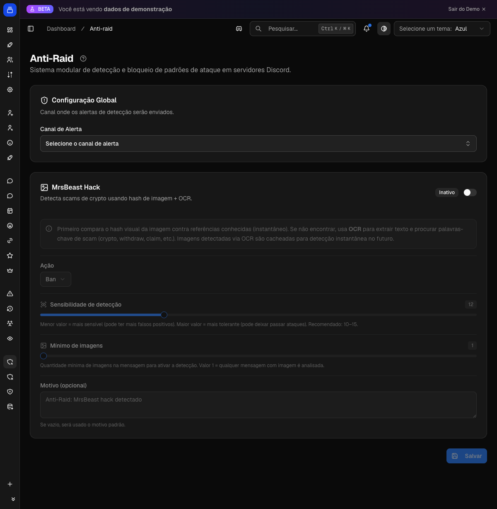

# Anti-raid

O Anti-raid bloqueia ataques de golpe em massa: dezenas de contas despejando a mesma arte ("sorteio do MrBeast", "código promocional de crypto", "resgate seu prêmio em USDT") em vários canais. Ele detecta, apaga a mensagem, pune o autor, limpa o rastro e avisa a moderação. Automático, em segundos.

{ .dx-shot loading=lazy }

*Configuração do anti-raid no [Dashboard](https://admin.delfus.app) — exemplo com dados de demonstração.*

## Como funciona

Quando alguém posta uma mensagem com imagem num servidor com o Anti-raid ligado, o bot analisa a imagem. Ele roda checagens em ordem, das mais leves para as mais pesadas, e para na primeira que confirmar um golpe.

São três:

- **Reincidência.** Ao punir alguém, o bot marca a pessoa como golpista por 5 minutos. Nesse tempo, tudo que ela postar é apagado na hora, sem reanálise. Evita que ela continue espalhando durante a punição.
- **Velocidade.** Se a mesma pessoa joga imagens em vários canais em poucos segundos, ou se um monte de contas novas posta junto, o bot trata como ataque (detalhes abaixo).
- **Imagem conhecida.** A camada principal. O bot calcula uma impressão digital visual da imagem e compara com uma base de golpes conhecidos. Se bater, é ataque.

!!! example "Exemplo"
    Alguém entra no servidor e posta um print de "sorteio oficial do MrBeast — resgate seus 5 BTC". O Delfus reconhece a arte do golpe, apaga a mensagem na hora e bane o autor, antes que mais alguém clique no link.

### Velocidade: flood e enxame

Com a checagem de velocidade ligada, o bot mede o ritmo de envio numa janela curta (padrão: 10 segundos) e reage a dois cenários:

- **Uma pessoa floodando vários canais.** Se a mesma conta espalha imagens por vários canais distintos de uma vez (padrão: 3 canais em 10 segundos), é ataque confirmado. Aqui a punição é sempre ban, independente do que você configurou.
- **Enxame de contas novas.** Se várias contas recém-chegadas (padrão: 5 contas que entraram há menos de 24h) começam a postar imagens ao mesmo tempo, o bot pisa no freio com cuidado: liga o modo lento no canal (slowmode de 30s) e chama a moderação. Ele nunca bane em massa nesse caso, só desacelera e pede revisão.

!!! note "Detalhe"
    A idade da conta no caso do enxame conta a partir de quando o membro entrou no servidor, não da data de criação no Discord.

### Aprendizado contínuo

Quando aparece uma arte de golpe nova que o bot ainda não conhece, ele tenta aprender com ela sem travar a resposta ao usuário.

Em segundo plano, o bot lê o texto da imagem (OCR) e procura palavras típicas de golpe: crypto, "claim", "airdrop", "promo code", "withdrawal success", "MrBeast", "Elon" e outras. Para não errar, ele só considera golpe quando o texto bate em pelo menos 2 categorias diferentes.

Ao reconhecer o padrão, ele memoriza a arte para sempre. A primeira mensagem com uma arte nova pode escapar, mas na próxima vez o bot barra na hora.

!!! note "Importante"
    Essa leitura de texto serve só para aprender. Ela não pune a mensagem atual. Quem pune são as camadas rápidas de reconhecimento de imagem e de velocidade.

### O que acontece quando um ataque é confirmado

Assim que qualquer camada confirma o golpe, o bot, em sequência:

1. **Apaga** a mensagem.
2. **Marca o autor como golpista por 5 minutos**, para apagar tudo que ele postar nesse intervalo.
3. **Aplica a punição** configurada: advertir, silenciar, expulsar ou banir.
4. **Avisa o canal de moderação**: qual módulo disparou, quem foi punido, qual ação e o motivo.
5. **Limpa o rastro**: varre os canais e apaga tudo que aquele usuário postou nos últimos 10 minutos.

!!! tip "Erra pro lado seguro"
    Se qualquer etapa falhar (download da imagem, leitura, cache indisponível), o bot prefere deixar passar a punir por engano. E ele só pune quem está abaixo do cargo dele na hierarquia. Alguém acima do bot não é tocado.

## Comandos

O Anti-raid não tem comandos de barra. Ele age sozinho sobre as mensagens dos canais. Toda a configuração é feita pelo painel.

## Configuração

Tudo pelo Dashboard, em [admin.delfus.app](https://admin.delfus.app), na seção **Anti-Raid**. Selecione o servidor, ajuste as opções e clique em **Salvar**. Para desligar tudo de uma vez, use **Remover Anti-Raid**.

**Configuração global**

- **Canal de Alerta** — onde a moderação recebe os avisos. Obrigatório: sem ele, o Anti-raid não funciona. Use um canal só da staff.

**Módulo "MrsBeast Hack" (reconhecimento de imagem)**

Um interruptor liga ou desliga o módulo. Com ele ativo, você define:

- **Ação** — o que fazer com o golpista: **Advertência**, **Mute** (duração de 60s a 28 dias; padrão 10 min), **Kick** ou **Ban** (padrão).
- **Sensibilidade** — de 5 a 30 (padrão 12). Quanto menor, mais sensível (pega variações, mas pode dar falso-positivo). Quanto maior, mais tolerante. O recomendado fica entre 10 e 15.
- **Mínimo de imagens** — de 1 a 10 (padrão 1). Quantas imagens a mensagem precisa ter para o bot analisar. Em 1, qualquer imagem é checada.
- **Motivo (opcional)** — texto que aparece na punição e no alerta. Vazio, o bot usa um padrão.

!!! note "Limites finos"
    As regras de velocidade (flood e enxame) fazem parte do Anti-raid, mas seus números exatos são ajustados pela equipe Delfus por servidor. Os padrões: 3 canais em 10s para flood de um usuário; 5 contas com menos de 24h para enxame; slowmode de 30s no bloqueio brando.

## Exemplos

!!! example "Servidor grande, proteção firme"
    Ative o **MrsBeast Hack**, deixe a ação em **Ban**, sensibilidade em torno de 12 e aponte o **Canal de Alerta** para a staff. Todo print do "sorteio do MrBeast" é apagado e o autor banido na hora, com o registro caindo no canal da moderação.

!!! example "Modo cauteloso, sem banir na hora"
    Prefere revisar antes? Escolha a ação **Mute** com 600 segundos. O golpe ainda é apagado e o autor fica calado por 10 minutos, tempo de a moderação conferir o alerta e decidir se bane manualmente.

!!! example "Servidor de artes/memes"
    Se membros legítimos postam imagens parecidas com golpes, suba a **Sensibilidade** para 15 e considere aumentar o **Mínimo de imagens**. O bot fica mais tolerante e foca só nos ataques óbvios.

## Requisitos

Para agir, o bot precisa das permissões certas:

- **Gerenciar mensagens** — para apagar o golpe e limpar o rastro.
- **Banir** e/ou **Expulsar membros** — conforme a ação escolhida (o flood sempre bane).
- **Moderar membros (timeout)** — se a ação for silenciar.
- **Gerenciar canais** — para ligar o slowmode num enxame.

Além disso, o cargo do bot precisa estar acima dos membros que ele vai punir, e o **Canal de Alerta** precisa estar configurado. Sem ele, o módulo nem roda.

## Perguntas frequentes

**Funciona com qualquer imagem ou só com golpes conhecidos?**
Ele já vem com uma base de golpes de referência e barra qualquer imagem parecida. Artes totalmente novas podem passar na primeira vez, mas o bot lê o texto delas em segundo plano e, ao reconhecer o padrão, memoriza a arte para barrar na hora depois.

**O bot pode banir um membro de boa-fé por engano?**
É raro: na dúvida, ele deixa passar. Todo bloqueio fica registrado no Canal de Alerta, então dá para revisar e reverter manualmente. Se aparecerem muitos falsos positivos, aumente a Sensibilidade.

**Ele bane todo mundo numa invasão de contas novas?**
Não. Enxame de contas novas gera só um bloqueio brando: modo lento no canal e aviso à moderação. Banimento automático rola para golpes reconhecidos individualmente e para o flood de um único usuário em vários canais.

**Por que o golpe sumiu de vários canais, não só do que eu vi?**
Ao pegar o golpista, o bot varre os canais e apaga tudo que ele postou nos últimos 10 minutos, removendo o que já tinha espalhado antes de ser pego.

!!! tip "Dica"
    Aponte o **Canal de Alerta** para um canal exclusivo da moderação e fique de olho nele. É por ali que cada bloqueio e alerta chega, o que te deixa confirmar ataques, revisar rápido e reverter na mão caso um membro legítimo seja afetado.

