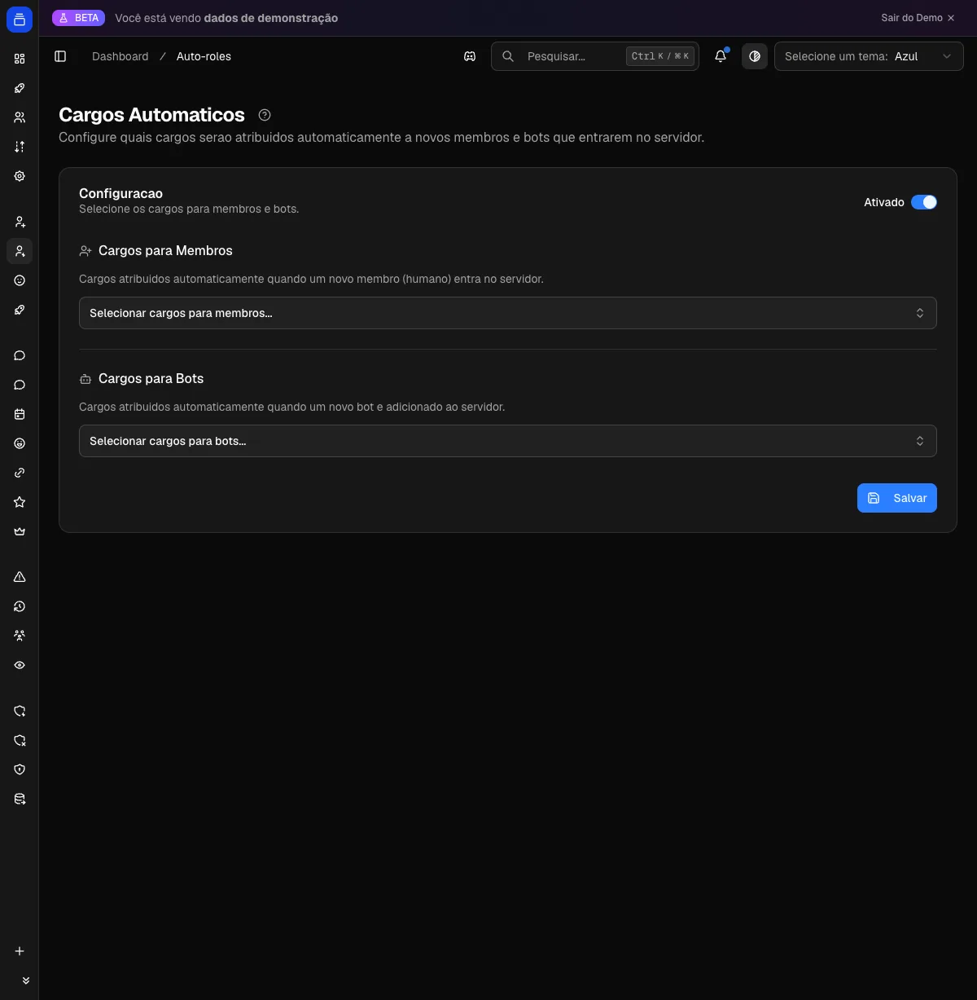

# Cargos automáticos (auto-role)

Toda conta nova que entra no seu servidor Discord já recebe do Delfus os cargos certos, sem ninguém da equipe atribuir na mão. Pessoas ganham uma lista de cargos; bots ganham outra, separada.

{ .dx-shot width="1200" height="1227" fetchpriority=high }

*Cargos automáticos no [Dashboard](https://admin.delfus.app) (exemplo com dados de demonstração).*

## Como funciona

Alguém entra, o Delfus entrega os cargos. Tudo no momento da entrada.

Antes de entregar, ele confere cada conta:

- **É pessoa ou bot?** Humanos recebem a lista de cargos de membros. Bots recebem a lista de bots.
- **Espera 1,5 segundo.** Esse atraso deixa o Discord assentar a entrada e segura a fila quando muita gente entra de uma vez. Nessa fila, pessoas têm prioridade sobre bots.
- **Entrega os cargos** um por um, registrando "Auto-role" no log de auditoria do servidor.

Alguns cargos são pulados de propósito: os que o membro já tem, os que foram apagados, e os que estão acima do Delfus na hierarquia (o Discord não deixa ele entregar cargo mais alto que o dele).

!!! example "Exemplo"
    Uma pessoa entra no servidor. Em poucos segundos ela aparece com o cargo de "Membro", a cor da comunidade e acesso aos canais de bate-papo. Logo depois entra um bot: esse ganha só o cargo "Bots", sem as cores e acessos pensados para gente.

!!! note "E se o Discord engasgar?"
    Se rolar instabilidade no meio da entrega, o Delfus lembra quais cargos já deu e tenta de novo de onde parou, até 5 vezes, sem duplicar nada. Se o membro entrou e saiu correndo, ele percebe e para de tentar.

## Comandos

Essa função não tem comando de barra. Tudo é configurado no painel: você define uma vez e o Delfus aplica a cada entrada.

## Configuração

No Dashboard em [admin.delfus.app](https://admin.delfus.app), seção **Cargos automáticos**:

1. **Ligue a função** no botão no topo do cartão.
2. **Escolha os cargos para Membros.** Pode colocar vários.
3. **Escolha os cargos para Bots.** Também pode colocar vários.
4. **Clique em Salvar.** Já vale para a próxima pessoa que entrar.

!!! tip "Pode deixar uma lista vazia"
    Quer cargo só para membros e nada para bots? Quando uma lista está vazia, o Delfus não faz nada para aquele tipo de conta.

Os seletores só mostram cargos que o Delfus consegue dar. Cargos gerenciados por integração (cargo de outros bots, boosters do Nitro, etc.) não aparecem, porque o próprio Discord não deixa atribuir eles na mão.

!!! warning "Hierarquia importa"
    O Delfus precisa da permissão **Gerenciar cargos**, e o **cargo dele tem que estar acima** de tudo que ele vai entregar na lista de cargos do servidor. Esse é o motivo número 1 de "configurei e o cargo não vem".

## Exemplos

!!! example "Cargo de Membro automático"
    Crie um cargo "Membro" com acesso aos canais públicos e coloque na lista de Membros. A partir daí, toda pessoa que entrar já enxerga e participa do servidor.

!!! example "Bots agrupados e isolados"
    Crie um cargo "Bots" com cor própria, posicionado abaixo dos cargos humanos, e use só na lista de Bots. Todo bot que entrar fica visualmente separado, sem as cores e acessos da galera.

!!! example "Boas-vindas com cor"
    Coloque um cargo de cor mais um cargo "Comunidade" na lista de Membros. Os novatos chegam com a cara do servidor e acesso ao bate-papo. Deixe os canais avançados para cargos que se conquistam depois.

## Perguntas frequentes

### Um dos cargos não foi dado. Por quê?
Quase sempre é hierarquia: o cargo está acima do Delfus na lista. Mova o cargo do Delfus para cima dele. Também pode ser cargo apagado, falta da permissão "Gerenciar cargos", ou o membro já ter aquele cargo.

### Demora para aplicar?
Tem um atraso de propósito (cerca de 1,5 segundo), além do tempo normal do Discord. Na prática, o membro recebe tudo em poucos segundos.

### Mudei a config, preciso reiniciar o bot?
Não. O Delfus lê a configuração a cada entrada. O que você salvar já vale para a próxima pessoa.

### E se o membro entrar e sair num piscar de olhos?
O Delfus tenta de novo automaticamente e lembra o que já entregou, sem duplicar. Se o membro saiu antes de receber, ele encerra a tentativa.

!!! tip "Dica"
    Deixe o cargo "Bots" **abaixo** dos cargos humanos e com permissões restritas. Os bots entram agrupados e isolados, e as cores e acessos ficam reservados para as pessoas. E lembre: o cargo do Delfus precisa ficar **acima** de tudo que ele vai entregar.
