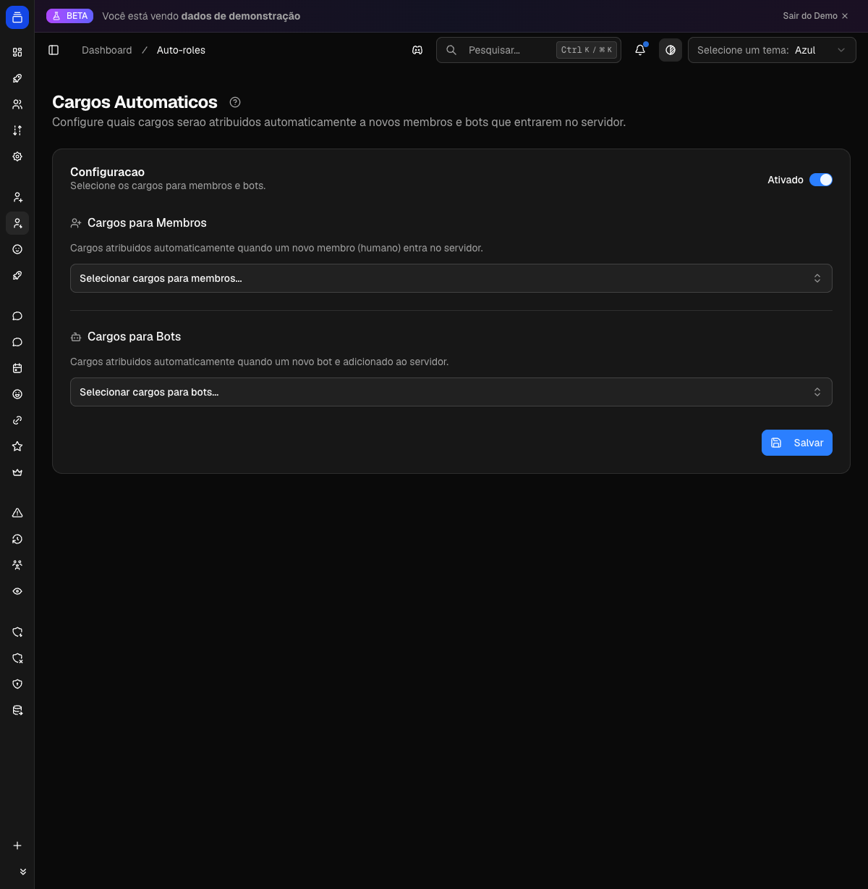

# Cargos automáticos

Os Cargos automáticos atribuem cargos a novos membros e bots assim que eles entram no servidor, sem nenhuma ação manual da equipe. É a forma mais simples de garantir que toda conta nova já chegue com o acesso certo aos canais e com a identidade visual correta (cores, separadores, cargo de "membro"), enquanto os bots recebem um conjunto separado de cargos próprios.

{ .dx-shot loading=lazy }

*Cargos automáticos no [Dashboard](https://admin.delfus.app) — exemplo com dados de demonstração.*

## Como funciona

Toda a mágica acontece no momento em que **alguém entra no servidor**. O Delfus escuta o evento de entrada de membro e, a partir dele, executa uma sequência cuidadosa de etapas para entregar os cargos de forma confiável, mesmo em momentos de pico (raids de entrada, divulgações, eventos).

### O fluxo, passo a passo

1. **Entrada detectada.** Assim que uma conta entra no servidor, o bot busca a configuração de Cargos automáticos daquele servidor. Essa leitura é feita na hora, a cada entrada — ou seja, qualquer alteração que você salvar no Dashboard já vale para o próximo membro que entrar, sem precisar reiniciar nada.

2. **Verificação de ativação.** Se a funcionalidade estiver **desativada** para o servidor, o bot não faz nada e encerra ali. Só prossegue quando os Cargos automáticos estão ligados.

3. **Humano ou bot?** O Delfus identifica se a conta que entrou é uma pessoa ou um bot e escolhe a lista de cargos correspondente: contas humanas recebem a **lista de cargos para membros**; bots recebem a **lista de cargos para bots**. Se a lista correspondente ao tipo de conta estiver vazia, o bot encerra sem fazer nada (por exemplo, se você configurou cargos só para membros, a entrada de um bot não dispara nenhuma atribuição).

4. **Entrada na fila de atribuição.** Em vez de aplicar os cargos imediatamente, o pedido entra em uma fila interna com um **pequeno atraso de cerca de 1,5 segundo**. Esse atraso serve para dar tempo do Discord "assentar" a entrada do membro e para suavizar picos quando muita gente entra de uma vez. A fila também respeita prioridades: **membros humanos têm prioridade sobre bots** — se um humano e um bot entram quase ao mesmo tempo, o humano é atendido primeiro.

5. **Aplicação dos cargos.** Quando chega a vez do pedido, o bot percorre cada cargo configurado e o adiciona ao novo membro, registrando o motivo "Auto-role" no log de auditoria do Discord. Durante essa etapa, alguns cargos são **pulados de forma silenciosa e proposital**:
   - Cargos que o membro **já possui** (não há por que adicionar de novo).
   - Cargos que **foram apagados** do servidor depois de configurados.
   - Cargos posicionados **acima do cargo do bot** na hierarquia do servidor — o Discord não permite que o bot atribua um cargo mais alto do que o dele.
   - Cargos para os quais o bot **não tem permissão** de gerenciar.

   Os cargos que passam por todas essas verificações são entregues, e em poucos segundos o novo membro aparece com todos eles.

### Robustez: novas tentativas e progresso parcial

O Delfus foi feito para não "perder" entregas por causa de instabilidades momentâneas do Discord (como limites de velocidade temporários):

- Se uma falha **temporária** acontece no meio da entrega, o bot **guarda quais cargos já foram aplicados** e tenta de novo automaticamente. Nas tentativas seguintes, ele retoma só de onde parou, sem re-adicionar o que já entregou — então não há risco de duplicar ou de "bagunçar" os cargos. Essa memória de progresso dura alguns minutos.
- O bot faz **até 5 tentativas** por membro, com espera crescente entre elas (espera um pouco mais a cada nova tentativa) para dar tempo do problema passar.
- Erros **permanentes** encerram a tentativa imediatamente, sem desperdiçar novas rodadas — por exemplo, quando o servidor não está mais acessível ao bot ou quando o membro **saiu antes** de receber os cargos.

### Quando tudo falha: fila de erros (DLQ)

Se mesmo depois de todas as tentativas uma entrega não for concluída, ela não é simplesmente descartada: vai para uma **fila de erros interna** (capaz de guardar até 1.000 registros recentes), com a data, o número de tentativas e o motivo da última falha. Isso permite que a equipe técnica reprocesse essas entregas depois (reenviar todas, reenviar apenas as de um servidor específico ou limpar a fila), sem que uma falha isolada trave as demais atribuições.

### Contadores

O Delfus mantém contadores por servidor que registram quantas atribuições foram **concluídas com sucesso**, quantas **falharam definitivamente** e quantas foram **parciais** (precisaram retomar de uma tentativa anterior). Esses números servem de termômetro da saúde do recurso no servidor.

## Comandos

Esta feature é configurada apenas pelo painel. Não há comandos de barra próprios — toda a operação acontece automaticamente na entrada de cada membro, a partir do que você definir no Dashboard.

## Configuração

A configuração é feita pelo Dashboard, em [admin.delfus.app](https://admin.delfus.app), na seção **Cargos automáticos**:

1. **Ative a funcionalidade** pelo botão de ativar/desativar no topo do cartão de configuração. Com a feature desligada, os seletores de cargos ficam visíveis mas inativos, e nenhum cargo é atribuído na entrada.
2. **Selecione os cargos para Membros (humanos).** Use o seletor "Cargos para Membros" para escolher um ou mais cargos que serão dados automaticamente a cada nova pessoa que entrar.
3. **Selecione os cargos para Bots.** Use o seletor "Cargos para Bots" para escolher os cargos atribuídos automaticamente quando um novo bot é adicionado ao servidor.
4. **Clique em Salvar** para aplicar. A nova configuração passa a valer imediatamente para as próximas entradas.

### Sobre as opções

- **Ativar/Desativar** — liga ou desliga toda a atribuição automática de uma vez, sem perder os cargos já selecionados.
- **Cargos para Membros** — lista de cargos aplicados a contas humanas. Pode conter vários cargos.
- **Cargos para Bots** — lista de cargos aplicados a contas de bot. Pode conter vários cargos.

Você pode deixar **uma das listas vazia** — por exemplo, configurar cargos só para membros e nenhum para bots (ou o contrário). Quando a lista de um tipo de conta está vazia, nada é feito para aquele tipo.

Os seletores mostram apenas os cargos que o bot pode realmente atribuir: **cargos gerenciados pela integração** (como o cargo próprio de outros bots, cargos de boosters do Nitro ou cargos vinculados a integrações) **não aparecem na lista**, porque o Discord não permite que sejam atribuídos manualmente.

## Exemplos de uso

- **Cargo de "Membro" automático.** Crie um cargo "Membro" com acesso aos canais públicos e adicione-o à lista de Cargos para Membros. A partir daí, toda pessoa que entrar já enxerga e participa do servidor sem precisar pegar um cargo manualmente.

- **Bots em quarentena visual.** Reserve um cargo "Bots" (com uma cor própria e posicionado abaixo dos membros humanos na lista de cargos) só para a lista de Cargos para Bots. Assim, todo bot adicionado fica visualmente separado e agrupado, sem ganhar os cargos de acesso e cor pensados para humanos.

- **Boas-vindas com cor.** Combine um cargo de cor e um cargo de "Comunidade" na lista de Membros para que novos integrantes já cheguem com a identidade visual do servidor e acesso aos canais de bate-papo, deixando os canais avançados para cargos conquistados depois.

## Requisitos

- O Delfus precisa da permissão **Gerenciar cargos**.
- O **cargo do bot** deve estar posicionado **acima**, na lista de cargos do servidor, de qualquer cargo que ele precise atribuir. Cargos posicionados acima do bot na hierarquia são silenciosamente ignorados — esse é o motivo mais comum de um cargo "não estar sendo dado".
- Os cargos escolhidos precisam existir no servidor no momento da entrada. Cargos apagados depois de configurados são ignorados automaticamente (vale revisar a configuração se você excluir cargos).

## Perguntas frequentes

**Por que um dos cargos não foi atribuído ao novo membro?**
Quase sempre é hierarquia: o cargo está acima do cargo do bot na lista de cargos do servidor. Mova o cargo do Delfus para cima desses cargos. Também pode ser que o cargo tenha sido apagado, que o bot esteja sem a permissão "Gerenciar cargos", ou que o membro já tivesse aquele cargo.

**Os cargos são aplicados na hora ou demora?**
Há um pequeno atraso proposital (cerca de 1,5 segundo) antes da entrega, além do tempo normal do Discord. Em condições normais, o membro recebe os cargos em poucos segundos após entrar.

**Se eu mudar a configuração, preciso reiniciar o bot?**
Não. A configuração é lida na hora, a cada entrada de membro, então a mudança que você salvar já vale para o próximo membro que entrar.

**E se o membro entrar e sair muito rápido, ou se houver uma instabilidade do Discord?**
O bot tenta de novo automaticamente (até 5 vezes, com espera crescente) e lembra quais cargos já entregou, para não duplicar. Se o membro saiu antes de receber os cargos, a tentativa é encerrada como falha permanente, sem ficar tentando à toa.

!!! tip "Dica"
    Use a separação entre membros e bots a seu favor: posicione o cargo de "Bots" **abaixo** dos cargos humanos na lista de cargos e dê a ele permissões restritas. Assim os bots entram agrupados e visualmente isolados, enquanto os cargos de cor e acesso ficam reservados só para as pessoas. E lembre: o cargo do Delfus precisa ficar **acima** de tudo o que ele vai atribuir.

