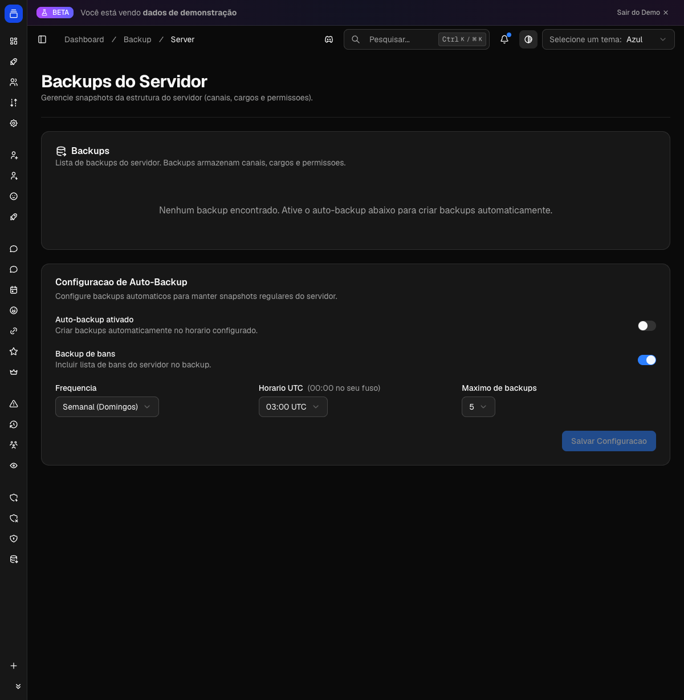

# Backups

Salve uma cópia completa da estrutura do seu servidor — cargos, canais, categorias, permissões e configurações — para poder restaurá-la depois caso algo dê errado: uma reformulação que não deu certo, um ataque que apagou canais, ou simplesmente um cargo importante que sumiu sem querer. O Delfus guarda essas "fotos" da estrutura e permite recriá-las com poucos cliques, sem precisar reconfigurar tudo na mão.

{ .dx-shot loading=lazy }

*Backups do servidor no [Dashboard](https://admin.delfus.app) — exemplo com dados de demonstração.*

## Como funciona

O recurso de Backups tem **três partes complementares**:

1. **Backup de estrutura** — uma "foto" completa de cargos, canais, categorias, permissões e configurações do servidor, criada e restaurada pelo painel `/backup`.
2. **Backups automáticos** — agendados pelo Dashboard, criam essa foto sozinhos numa frequência e horário definidos.
3. **Backup de cargos de membros (snapshots)** — uma foto dos cargos de um membro tirada quando ele sai, para devolvê-los caso ele volte, via `/restaurar-cargos`.

### O que um backup de estrutura captura

Cada backup é uma foto da estrutura do servidor no momento em que foi criado. Ele guarda:

- **Cargos**: nome, cor, se aparece separado na lista (hoist), se é mencionável, todas as permissões, posição na hierarquia, ícone e emoji. As permissões do `@everyone` também são salvas.
- **Canais e categorias**: nome, tipo, posição, categoria-pai, tópico, NSFW, modo lento (slowmode), bitrate e limite de usuários (voz), região de voz, e o layout/ordenação de fóruns. Para cada canal, são salvas as **permissões personalizadas (overwrites)** de cada cargo e membro.
- **Configurações do servidor**: ícone, banner, splash, descrição, nível de verificação, filtro de conteúdo explícito, notificações padrão, canal e tempo de AFK, canal de sistema (e suas flags), canal de regras, idioma preferido e nível NSFW.
- **Tópicos (threads)**: nome, tipo, canal-pai, se está arquivado/travado, duração de auto-arquivamento e modo lento.
- **Banimentos** (opcional, ligado por padrão): a lista de usuários banidos e o motivo de cada ban.

Um backup **não** salva mensagens, conteúdo de canais nem a lista de membros — apenas a estrutura. (Os cargos individuais de membros são guardados por um recurso separado, o snapshot de saída, descrito mais abaixo.)

A foto é **compactada** para ocupar pouco espaço e tem um limite técnico de tamanho (cerca de 2 MB compactados). Em servidores enormes, se a foto passar do limite, o bot remove automaticamente as seções menos críticas para caber — primeiro a lista de banimentos, depois os tópicos — sem cancelar o backup.

### Criando e gerenciando backups pelo painel `/backup`

Tudo acontece num painel interativo aberto pelo comando `/backup`. **Apenas o dono do servidor** pode abri-lo (qualquer outra pessoa recebe "Permissão negada"). O painel mostra, no topo, o backup mais recente e o total de backups guardados, e oferece quatro botões:

#### Criar

1. Você clica em **➕ Criar** e abre uma janelinha (modal) pedindo um **nome** para o backup (opcional, até 100 caracteres — ex.: "pré-reformulação dos canais").
2. Se você não digitar nada, o bot gera um nome padrão automático com a data e hora.
3. O bot mostra "Criando backup..." e captura a foto do servidor. Em poucos segundos, exibe um resumo: número de cargos, canais, categorias, tamanho do arquivo e — quando houver — quantidade de threads, membros e bans guardados.
4. Depois de salvar, o bot aplica o **limite de quantidade**: o servidor mantém um número máximo de backups (5 por padrão, configurável de 1 a 10). Quando o limite é ultrapassado, o backup mais antigo é apagado automaticamente para dar lugar ao novo.

#### Listar

O botão **📋 Listar** mostra todos os backups, paginados (5 por página), com ID, nome, versão, contagem de cargos/canais e quando cada um foi criado.

#### Restaurar

Detalhado na seção [Restaurando um backup](#restaurando-um-backup) abaixo.

#### Deletar

O botão **🗑️ Deletar** abre uma lista para você escolher um backup, pede uma **confirmação** ("essa ação não pode ser desfeita") e remove o backup escolhido.

O painel guarda o seu progresso (qual backup você escolheu, qual modo, etc.) por cerca de 10 minutos. Se você ficar muito tempo parado, o painel volta para o início e você recomeça a operação.

### Backups automáticos

Se ativado pelo Dashboard, o bot cria backups sozinho:

1. Uma vez por hora, o bot verifica todos os servidores e checa se o **horário configurado** (em UTC) bate com a hora atual.
2. Na frequência **Diária**, ele cria um backup todo dia naquela hora. Na frequência **Semanal**, apenas aos **domingos**.
3. Um mecanismo de trava impede que o mesmo dia gere backups duplicados, mesmo que o bot reinicie.
4. O backup automático é salvo com um nome como "Auto-backup AAAA-MM-DD" e respeita o **mesmo limite de quantidade** dos backups manuais (os mais antigos são apagados quando o limite é atingido).

Como o horário é em **UTC**, lembre que ele pode estar algumas horas adiantado em relação ao seu fuso (o Brasil é UTC−3).

### Restaurando um backup

Pelo painel `/backup`, no botão **♻️ Restaurar**, você escolhe um backup da lista e configura a restauração:

#### 1. Modo de restauração

- **➕ Aditivo**: recria os cargos, canais e categorias do backup **ao lado** do que já existe, sem apagar nada. É o modo seguro — executa imediatamente.
- **💥 Destrutivo**: **apaga** os cargos e canais atuais antes de recriar a estrutura do backup, recomeçando do zero a partir da foto. Por ser irreversível, exige uma **tela extra de confirmação** ("⚠️ Restauração destrutiva — tem certeza?"). No modo destrutivo, o bot **não apaga** o `@everyone`, cargos gerenciados por integrações (bots, boosters), nem canais protegidos exigidos por servidores de Comunidade (sistema, regras, novidades) — esses são preservados ou recriados.

#### 2. O que restaurar (seções)

Quando o backup é completo (versão 2), você marca o que recriar:

- **Cargos e Canais** — sempre incluído.
- **Configurações do Servidor** — ícone, banner, nível de verificação, canais de sistema/regras/AFK, idioma, etc. (aparece se o backup tiver essas configurações).
- **Cargos dos Membros e Nicknames** — reaplica cargos e apelidos aos membros (aparece só se o backup contiver esses dados).
- **Bans** — rebane os usuários listados (aparece só se o backup contiver banimentos).

#### 3. Execução em etapas

A restauração roda em **fases ordenadas**, com um ritmo controlado para não esbarrar nos limites do Discord:

1. **Cargos** (recriados de baixo para cima na hierarquia);
2. **Categorias**;
3. **Canais** (já encaixados nas categorias certas, com as permissões remapeadas para os novos cargos);
4. **Configurações do servidor** (se marcado);
5. **Cargos dos membros** e **apelidos** (se marcado);
6. **Bans** (se marcado).

Durante o processo, o painel mostra uma **barra de progresso** com a fase atual e os erros/avisos que forem surgindo. Por causa do ritmo controlado (uma pausa entre cada operação e novas tentativas automáticas quando o Discord pede para esperar), em servidores grandes a restauração **pode levar vários minutos**. Só **uma restauração por vez** pode rodar em cada servidor — se você tentar iniciar outra enquanto uma está em andamento, o bot avisa e bloqueia.

Ao final, você recebe um **resumo** indicando sucesso, sucesso com avisos, ou falha, listando os **erros** (ex.: um cargo que o bot não conseguiu recriar) e **avisos** (ex.: um membro que não está mais no servidor, um canal protegido pulado). A lista de erros/avisos é limitada para não estourar o tamanho da mensagem.

### Restaurar cargos de um membro específico (snapshots)

Além do backup de estrutura, existe o backup de **cargos por membro**. Quando o recurso está ativado, o bot tira uma "foto" dos cargos de um membro no momento em que ele **sai do servidor**. Mais tarde, com o comando `/restaurar-cargos` (ou `/restore-roles`), você devolve esses cargos — útil para quando alguém sai e volta, ou foi removido por engano.

1. Você usa o comando informando o **membro** alvo.
2. O bot busca o **snapshot mais recente** daquele membro. Se não houver nenhum, ele avisa que não há foto salva (lembrando que os snapshots são criados na saída, se o recurso estiver habilitado).
3. O bot mostra um **preview paginado** (15 cargos por página) classificando cada cargo:
   - `+` cargos que serão **adicionados**;
   - `=` cargos que o membro **já possui**;
   - cargos **indisponíveis** (riscados), com o motivo: `deletado` (o cargo não existe mais), `gerenciado` (cargo de integração que não pode ser dado manualmente) ou `hierarquia` (o cargo está acima do bot, fora do alcance dele).
4. Você confirma com o botão **Confirmar**, e o bot aplica os cargos disponíveis ao membro. A confirmação fica válida por cerca de 5 minutos; depois disso, é preciso rodar o comando de novo.
5. No final, o bot mostra quantos cargos foram **aplicados**, **ignorados** e quantos deram **erro**.

O membro precisa estar **no servidor** para receber os cargos — se ele ainda não voltou, o preview avisa que nada poderá ser aplicado. Quantas fotos são guardadas por pessoa é configurável (2 por padrão); ao atingir o limite, as mais antigas são descartadas.

## Comandos

| Comando | O que faz |
| --- | --- |
| `/backup` | Abre o painel de backups do servidor (somente o dono). Por ali você cria, lista, restaura e deleta backups de estrutura. |
| `/restaurar-cargos` (`/restore-roles`) | Restaura os cargos de um membro a partir do snapshot mais recente. Opção `membro`: o membro cujos cargos serão restaurados. |

## Configuração

A criação, restauração e exclusão de backups de **estrutura** são feitas pelo painel `/backup` dentro do Discord (somente o dono do servidor). Já as **opções de automação e os limites** são definidos pelo Dashboard em [admin.delfus.app](https://admin.delfus.app).

### Página "Backups do Servidor" (Dashboard)

Nessa página você consegue:

- **Ver e deletar** os backups existentes (com a origem de cada um: manual, automático ou pelo painel).
- Configurar o **Auto-Backup**:
  - **Auto-backup ativado** — liga/desliga a criação automática.
  - **Backup de bans** — inclui ou não a lista de banimentos nas fotos (ligado por padrão).
  - **Frequência** — *Diário* ou *Semanal (Domingos)*.
  - **Horário** — a hora do dia (de 00:00 a 23:00, **em UTC**) em que o backup automático roda.
  - **Máximo de backups** — quantas fotos guardar por servidor (de **1 a 10**, padrão 5). Ao ultrapassar, as mais antigas são apagadas.
- Salve com o botão **Salvar Configuração**.

### Página "Backup de Usuários" (Dashboard)

Controla os snapshots de cargos por membro, usados pelo `/restaurar-cargos`:

- **Snapshot automático ao sair** — liga/desliga a captura automática dos cargos quando um membro sai.
- **Máximo de snapshots por usuário** — quantas fotos guardar por pessoa (de **1 a 10**, padrão 2). As mais antigas são removidas ao atingir o limite.
- Também é possível **buscar e deletar** snapshots já guardados.

## Exemplos de uso

- **Antes de reformular o servidor**: rode `/backup`, clique em **➕ Criar** e dê o nome "antes da reforma de canais". Se a reorganização não der certo, abra `/backup` de novo, clique em **♻️ Restaurar**, escolha esse backup no modo **Aditivo** e recrie a estrutura antiga sem apagar nada do que já existe.

- **Recuperação após um ataque que apagou canais**: abra `/backup`, **♻️ Restaurar**, escolha o backup mais recente. Use **Aditivo** para trazer de volta os canais e cargos perdidos lado a lado com o que sobrou, ou **Destrutivo** se quiser zerar tudo e recriar exatamente como estava na foto.

- **Proteção contínua sem esforço**: no Dashboard, na página "Backups do Servidor", ligue o **Auto-backup**, escolha *Diário* às 06:00 UTC e deixe **Máximo de backups** em 7. O bot passa a guardar uma semana de fotos diárias automaticamente.

- **Devolver cargos a quem voltou**: ative o "Snapshot automático ao sair" na página "Backup de Usuários". Quando um membro antigo retornar, use `/restaurar-cargos` escolhendo-o, confira o preview e confirme para devolver os cargos que ele tinha.

## Requisitos

- O bot precisa de **Gerenciar Cargos** e **Gerenciar Canais** para criar e restaurar a estrutura (o painel `/backup` já exige essas permissões para abrir).
- Para restaurar **configurações do servidor**, o bot também precisa de **Gerenciar Servidor**; para restaurar **banimentos**, precisa de **Banir Membros**. Se faltar a permissão de uma seção marcada, o bot avisa e não executa.
- Na restauração, o bot só consegue recriar/aplicar cargos que fiquem **abaixo** do cargo dele na hierarquia. Posicione o cargo do bot bem no topo antes de restaurar — cargos acima dele aparecem como "hierarquia" e são pulados.
- Apenas o **dono do servidor** pode abrir e usar o painel `/backup`.
- O painel e a confirmação de restauração de cargos dependem do sistema de estado em tempo real do bot; em raros momentos de instabilidade, a operação pode pedir para tentar de novo.

## Perguntas frequentes

**O backup salva as mensagens dos canais?**
Não. O backup guarda apenas a estrutura (cargos, canais, categorias, permissões e configurações) — nunca o conteúdo das mensagens nem a lista de membros.

**Posso restaurar sem apagar o que já existe?**
Sim. Use o modo **Aditivo**: ele recria os itens do backup ao lado dos atuais, sem deletar nada. O modo **Destrutivo** (que apaga antes de recriar) só roda após uma confirmação extra.

**Por que alguns cargos não foram restaurados?**
Cargos acima do cargo do bot na hierarquia, cargos já deletados ou cargos gerenciados por integrações não podem ser recriados/aplicados — eles aparecem no resumo como ignorados. Suba o cargo do bot e tente de novo.

**Quantos backups o servidor guarda?**
De 1 a 10 (padrão 5), definido no Dashboard. Ao criar um novo acima do limite, o backup mais antigo é apagado automaticamente. Os snapshots de cargos por membro têm um limite próprio (padrão 2 por pessoa).

!!! tip "Dica"
    Antes de qualquer mudança grande (reformular canais, reorganizar cargos), crie um backup manual com um nome descritivo. Se algo der errado, restaure no modo **Aditivo** primeiro — ele não apaga nada e é fácil de reverter. Deixe o **Destrutivo** apenas para quando você realmente quer recomeçar do zero, e lembre de subir o cargo do bot ao topo da hierarquia antes, para que ele consiga recriar todos os cargos.

