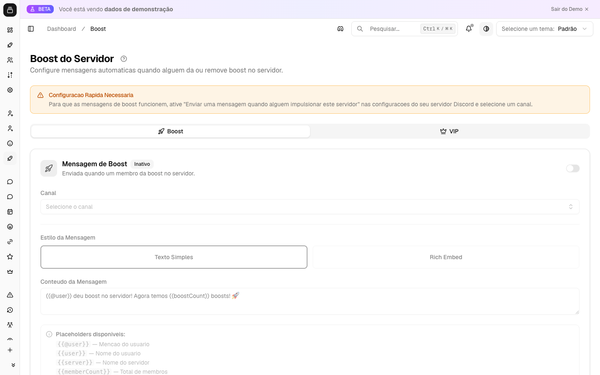

# Recompensas de boost

Reage automaticamente quando alguém impulsiona (boost) o seu servidor: envia uma mensagem de agradecimento personalizada e, opcionalmente, concede um plano VIP ao membro que impulsionou. Também pode enviar uma mensagem quando alguém deixa de impulsionar.

{ .dx-shot loading=lazy }

*Recompensas de boost no [Dashboard](https://admin.delfus.app) — exemplo com dados de demonstração.*

## Como funciona

O bot fica de olho nos boosts do servidor em tempo real. Quando o Discord avisa que um membro começou (ou parou) de impulsionar, o seguinte acontece:

1. **Alguém impulsiona o servidor.** O bot detecta o início do boost.
2. **Mensagem de agradecimento.** Se você ativou a mensagem de boost, o bot publica no canal escolhido a mensagem que você configurou. Ela pode ser um texto simples ou um embed (com título, descrição, cor, imagem, rodapé e botões de link). Dá para usar variáveis que são substituídas na hora, como o nome de quem impulsionou (`{{user}}` ou a menção `{{@user}}`), o nome do servidor (`{{server}}`), a contagem de membros (`{{memberCount}}`), o total de boosts (`{{boostCount}}`) e o nível de boost do servidor (`{{boostTier}}` / `{{boostTierName}}`).
3. **VIP automático (opcional).** Se você ativou a recompensa VIP, o membro que impulsionou recebe automaticamente o plano (tier) que você escolheu, com a duração que você definiu (padrão de 30 dias).
4. **Renovação automática enquanto o boost continuar.** A cada algumas horas, o bot revisa quem ainda está impulsionando o servidor. Se o boost continua ativo mas o VIP concedido já venceu, ele renova o VIP automaticamente. Isso cobre o caso em que o membro renova o boost sem intervalo — situação em que o Discord não dispara um novo aviso. Na prática, o membro mantém o benefício VIP pelo tempo em que continuar impulsionando.
5. **Quando alguém deixa de impulsionar.** Se você configurou a mensagem de "unboost", o bot publica essa mensagem no canal escolhido (com as mesmas opções de personalização da mensagem de boost).

As mensagens de boost, de unboost e a recompensa VIP são independentes: você pode ativar só uma, duas ou todas.

## Configuração

Tudo é configurado pelo Dashboard, na seção **Boost** (https://admin.delfus.app), por servidor:

- **Mensagem de boost** — ative, escolha o canal, o formato (texto ou embed), o conteúdo, a imagem e os botões de link.
- **Mensagem de unboost** — mesma ideia, disparada quando alguém deixa de impulsionar.
- **Recompensa VIP** — ative, escolha o plano (tier) VIP que será concedido e a duração em dias.

Não há comando de barra para configurar esta feature — toda a configuração é feita pelo painel.

## Requisitos

- Para enviar as mensagens, o bot precisa ter acesso e permissão de envio no canal escolhido para boost/unboost.
- Para a recompensa VIP, é preciso ter pelo menos um plano VIP criado no servidor, já que você seleciona qual plano será concedido.

!!! tip
    Deixe a recompensa VIP ativa para incentivar boosts duradouros: enquanto o membro continuar impulsionando, o bot renova o VIP sozinho — ele só perde o benefício quando o VIP vence e o boost já não está mais ativo.
