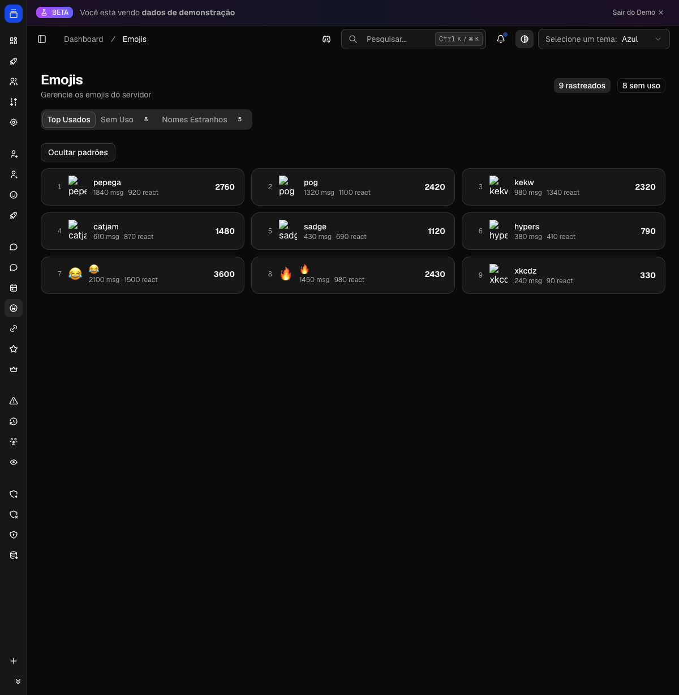

# Emojis

Veja quais emojis a comunidade mais usa, quais nunca saíram do lugar e quais têm nomes mal escolhidos. A partir do painel você ainda renomeia, exclui e clona emojis sem abrir o Discord. A página fica em `/dashboard/emojis`.

{ .dx-shot loading=lazy }

*Estatísticas de emojis no [Dashboard](https://admin.delfus.app) (dados de demonstração).*

## Como funciona

O bot conta cada uso de emoji em tempo real, por servidor. Há duas fontes de contagem:

- **Mensagens** (`msg`): toda vez que alguém envia uma mensagem, o bot extrai os emojis do texto e soma uma ocorrência para cada um.
- **Reações** (`react`): cada reação adicionada a uma mensagem conta uma ocorrência.

Mensagens de bots não entram na contagem de mensagens, e reações do próprio bot ou de outros bots são ignoradas.

A contagem cobre tanto emojis customizados (do próprio servidor ou externos) quanto emojis padrão Unicode. Para emojis customizados, o bot marca se ele pertence ao servidor atual (`is_server_emoji`) ou veio de fora (`Externo`).

Para não gravar no banco a cada mensagem, o bot acumula os usos em memória e grava em lote uma vez por minuto. Isso significa que os números aparecem com até cerca de um minuto de atraso, o que é normal.

O painel organiza tudo em três abas e um par de contadores no topo: **rastreados** (total de emojis com pelo menos um uso registrado) e **sem uso** (emojis do servidor que nunca foram usados).

### Top Usados

Lista os emojis mais usados, do maior para o menor total. Cada item mostra:

- a posição no ranking;
- a imagem (ou o caractere, no caso de emoji padrão) e o nome;
- contagem separada de `msg` e `react`;
- o total somado.

O botão **Ocultar padrões** filtra a lista para mostrar só emojis customizados, escondendo os Unicode. Emojis externos (customizados que não são do servidor) ganham o selo **Externo** e um botão para clonar direto para o servidor.

### Sem Uso

Lista os emojis do servidor que não têm nenhum uso registrado. Útil para faxina: cada item traz botões de renomear e excluir.

!!! note
    "Sem uso" reflete o que o bot rastreou desde que passou a contar. Um emoji adicionado há muito tempo pode aparecer aqui se ninguém o usou no período rastreado.

### Nomes Estranhos

Lista emojis do servidor cujo nome parece mal escolhido, para você renomear. Um nome é considerado estranho quando:

- é só números (ex.: `123`);
- tem 1 caractere ou menos;
- é só underscores, ou começa/termina com dois ou mais underscores;
- é um nome genérico: `emoji`, `emote`, `custom`, `sticker`, `image`, `img`, `pic`, `icon`, `face`, `reaction`, `react`, `unknown`, `untitled`, `new`, `test`, `temp`, `tmp`;
- parece string aleatória (mais de 3 caracteres e nenhuma vogal, ex.: `xkcdz`).

Os mesmos botões de renomear e excluir aparecem aqui.

## Gestão de emojis

Três ações ficam disponíveis na página, sempre aplicadas ao servidor selecionado:

| Ação | Onde aparece | O que faz |
| --- | --- | --- |
| Renomear | Abas Sem Uso e Nomes Estranhos | Troca o nome do emoji. Aceita 2 a 32 caracteres, apenas letras, números e underscores. |
| Excluir | Abas Sem Uso e Nomes Estranhos | Remove o emoji do servidor. Pede confirmação e não pode ser desfeito. |
| Clonar | Aba Top Usados (só emojis externos) | Copia um emoji externo para o seu servidor, mantendo nome e tipo (estático ou animado). |

A clonagem só funciona para emojis customizados externos, ou seja, os que aparecem com o selo **Externo**. Emojis padrão Unicode e os que já são do servidor não têm essa opção.

## Configuração

Não há nada para configurar pelo usuário. O rastreamento liga sozinho assim que o bot está no servidor; basta escrever mensagens e reagir para os números começarem a aparecer.

Para renomear, excluir ou clonar, o bot precisa da permissão **Gerenciar Emojis e Figurinhas** no servidor. Sem ela, essas ações falham.

## Exemplos

!!! example "Limpar emojis que ninguém usa"
    Abra a aba **Sem Uso**, veja a lista de emojis sem nenhuma contagem e use o botão de excluir nos que não fazem mais sentido. Cada exclusão pede confirmação.

!!! example "Roubar um emoji externo para o servidor"
    Na aba **Top Usados**, procure um item com o selo **Externo** (alguém usou um emoji de outro servidor). Clique no botão de adicionar para cloná-lo. Ele entra no seu servidor com o mesmo nome.

!!! example "Arrumar nomes ruins de uma vez"
    Abra **Nomes Estranhos**. O painel já filtrou os emojis com nomes genéricos, só números ou sem vogais. Renomeie um a um para algo pesquisável.

## Perguntas frequentes

**Por que meu uso de emoji ainda não apareceu?**
A contagem é gravada em lote a cada minuto. Espere um pouco e atualize.

**Mensagens e reações antigas contam?**
Não. O bot só conta a partir do momento em que passou a rastrear. Histórico anterior não é importado.

**A aba Sem Uso some com emojis que eu uso?**
Sim. Assim que um emoji recebe pelo menos um uso (mensagem ou reação), ele sai de Sem Uso e passa a aparecer em Top Usados.

**O que significa o selo Externo?**
É um emoji customizado de outro servidor que apareceu nas suas mensagens ou reações. Você pode cloná-lo para o seu servidor pela aba Top Usados.

**Por que não consigo renomear nem excluir um emoji?**
Verifique se o bot tem a permissão **Gerenciar Emojis e Figurinhas** no servidor. Essas ações também ficam indisponíveis no modo demonstração.

**Posso clonar um emoji padrão (Unicode)?**
Não. Clonar só vale para emojis customizados externos.
