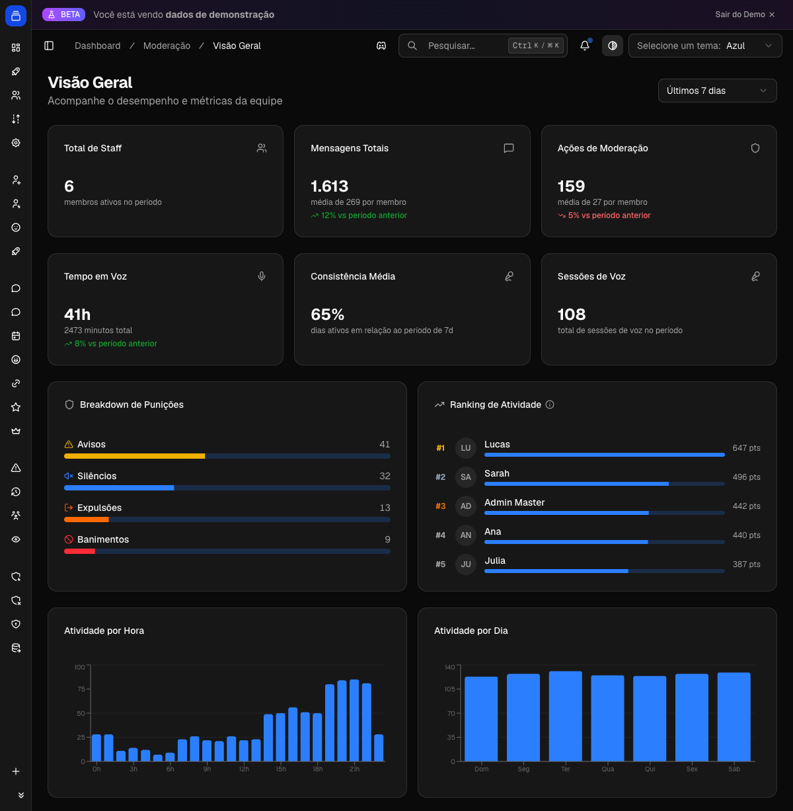

# Gestão de Equipe (Staff)

Você vê quem da sua equipe está ativo, quanto cada um produz e quem está abaixo do esperado. O painel cruza mensagens, tempo em voz e ações de moderação de cada membro de staff, agrupa por setor e dispara alertas quando alguém cai de produção. Tudo em `/dashboard/staff`.

{ .dx-shot loading=lazy }

*Painel de gestão de equipe no [Dashboard](https://admin.delfus.app) (exemplo com dados de demonstração).*

## Como funciona

O sistema parte de uma definição simples: **quem é staff são os donos dos cargos que você marcou** na configuração. A partir daí, para cada membro com um desses cargos, o bot já coleta três fontes de dados no dia a dia:

- **Mensagens:** contagem por hora, por canal (agregada, sem registrar mensagem por mensagem).
- **Voz:** sessões em canais de voz, com duração de cada uma.
- **Moderação:** cada `warn`, `ban`, `mute` e `kick` aplicado, vinculado a quem aplicou.

O painel lê esses dados sobre um período (7d, 30d, etc.) e calcula as métricas. As cinco rotas atendem perguntas diferentes:

| Rota | Para quê |
| --- | --- |
| `/dashboard/staff/overview` | Visão geral: todos os membros lado a lado, médias da equipe, heatmap de atividade |
| `/dashboard/staff/sector` | Mesma análise, agrupada por setor (categoria do cargo) |
| `/dashboard/staff/individual` | Lista individual com busca e ordenação por atividade |
| `/dashboard/staff/members/[userId]` | Perfil completo de um membro |
| `/dashboard/staff/alertas` | Quem está abaixo dos limites de atividade |
| `/dashboard/staff/config` | Define os cargos de staff e seus setores |

### Métricas de desempenho

Cada membro tem três blocos de métricas no período selecionado.

**Mensagens**

- **Total** e **média por dia**.
- **Canais únicos:** em quantos canais diferentes participou.
- **Dias ativos** e **cobertura**: percentual de dias do período com pelo menos uma mensagem. Cobertura de 100% significa atividade todo dia.
- **Consistência:** mesmo cálculo da cobertura, usado como nota de regularidade (0 a 100).

**Moderação**

- Contagem separada de **warns, bans, mutes e kicks**, mais o **total**.
- **Dias com ação:** em quantos dias do período aplicou ao menos uma punição.

**Voz**

- **Minutos totais**, **número de sessões** e **duração média por sessão**.

**Tendências:** cada bloco compara o período atual com o período imediatamente anterior de mesmo tamanho. Uma queda de 40% nas mensagens dos últimos 7 dias é medida contra os 7 dias anteriores. Aparece como variação percentual.

### Médias e comparação

A visão geral calcula a **média de mensagens por staff** e a **média de ações de moderação por staff**. Cada membro é comparado contra essas médias, então você enxerga rápido quem puxa para cima e quem fica abaixo do time.

O **heatmap** mostra atividade por dia da semana × hora do dia (grade de 7×24). O valor de cada célula soma mensagens e metade dos minutos de voz, revelando os horários de cobertura da equipe.

### Divisão por setor

Setores vêm das **categorias** atribuídas aos cargos na configuração. Um membro entra no setor de cada categoria dos cargos que possui. Quem tem cargo sem categoria cai em **Sem Setor**.

A visão por setor mostra, para cada grupo: número de membros, total de mensagens, total de ações de moderação e tempo em voz somados. Expandindo o setor, você vê a grade de métricas individuais daquele grupo. Serve para comparar áreas, por exemplo a atividade da Segurança contra a da Liderança.

### Métricas individuais

O perfil de um membro (`/members/[userId]`) traz tudo do membro mais detalhes que só existem no nível individual:

- **Top canais de mensagens** e **top canais de voz** (5 de cada).
- **Atividade por hora** (24 pontos) e **por dia da semana** (7 pontos, com mensagens e minutos de voz).
- **Heatmap pessoal** (7×24).
- **Últimas 10 ações de moderação:** tipo, alvo, motivo e data.
- **Radar de competências:** quatro eixos de 0 a 100: Comunicação, Presença, Moderação e Consistência.

### Alertas de baixa atividade

A página de alertas varre todos os membros e marca quem fica abaixo dos limites. Os limites são definidos **por semana** e ajustados ao tamanho do período (um período de 14 dias dobra o mínimo).

Limites padrão por semana:

| Limite | Padrão |
| --- | --- |
| Mensagens | 50 |
| Ações de moderação | 5 |
| Minutos em voz | 30 |
| Cobertura de dias | 50% |

Tipos de alerta gerados:

- **Inativo:** zero mensagens, zero voz e zero moderação no período. Sempre **crítico**.
- **Mensagens insuficientes:** abaixo do mínimo, ou cobertura abaixo de 50%. Vira **crítico** se ficar abaixo de metade do mínimo.
- **Moderação insuficiente:** só conta para membros do setor **Segurança** (cargos categorizados como `Segurança`) que têm mensagens mas pouca moderação.
- **Voz insuficiente:** minutos em voz abaixo do mínimo.
- **Queda de tendência:** queda acima de 40% nas mensagens (ou moderações) versus o período anterior. Acima de 70% vira **crítico**.

Cada alerta é **Aviso** ou **Crítico**, agrupado por tipo e ordenado do pior para o melhor. Você pode filtrar por setor para focar numa área. Clicar num alerta abre o perfil do membro.

!!! note "Por que moderação só vale para Segurança"
    Cobrar ações de moderação de um cargo de mídia social ou eventos não faz sentido. O alerta de moderação só dispara para quem está na categoria `Segurança`, evitando ruído.

## Configuração

Toda a configuração fica em `/dashboard/staff/config`. Sem nenhum cargo marcado, o painel não tem como saber quem é staff e as outras telas ficam vazias.

1. **Selecione os cargos de staff:** escolha os cargos do servidor que representam sua equipe (moderação, admin, suporte).
2. **Atribua categorias (opcional):** agrupe cada cargo num setor. Vêm prontos `Segurança` e `Liderança`; você pode criar outros. A categoria habilita a análise por setor e o alerta de moderação.
3. **Salve:** a partir daí as métricas e relatórios passam a considerar esses cargos.

Os cargos ficam salvos por servidor. Remover um cargo que tinha categoria pede confirmação, porque a categorização daquele cargo é perdida.

Os membros são sincronizados pelo bot: ao detectar um usuário com um cargo de staff, ele registra o vínculo usuário-cargo. Um mesmo membro pode ter vários cargos de staff e aparece em todos os setores correspondentes.

## Exemplos

!!! example "Encontrar quem sumiu na última semana"
    1. Abra `/dashboard/staff/alertas`.
    2. Deixe o período em **7d**.
    3. Olhe o grupo **Inativos** (crítico): são membros sem nenhuma mensagem, voz ou moderação na semana.
    4. Em seguida veja **Queda de tendência** para quem ainda aparece, mas despencou versus a semana anterior.

!!! example "Comparar dois setores"
    1. Configure ao menos dois cargos com categorias diferentes (ex: `Segurança` e `Suporte`).
    2. Abra `/dashboard/staff/sector`.
    3. Compare os totais no cabeçalho de cada setor: mensagens, ações e voz.
    4. Expanda um setor para ver membro a membro.

!!! example "Avaliar um moderador específico"
    1. Em `/dashboard/staff/individual`, busque pelo nome e ordene por **Mais ativos**.
    2. Clique no membro para abrir o perfil.
    3. Veja o radar de competências, os top canais e as últimas 10 ações de moderação para entender onde ele atua.

## Perguntas frequentes

**O painel está vazio. Por quê?**
Provavelmente nenhum cargo de staff foi configurado. Vá em `/dashboard/staff/config` e selecione ao menos um cargo.

**Por que um membro aparece em "Sem Setor"?**
Ele tem um cargo de staff, mas esse cargo não recebeu categoria. Atribua uma categoria ao cargo na configuração.

**O alerta de moderação não aparece para alguns membros.**
É o comportamento esperado. Esse alerta só vale para membros no setor `Segurança`. Cargos de outras categorias não são cobrados por moderação.

**Os limites de alerta são fixos?**
Os padrões são 50 mensagens, 5 ações, 30 minutos de voz e 50% de cobertura por semana, ajustados proporcionalmente ao período escolhido.

**As tendências comparam com o quê?**
Com o período anterior de mesmo tamanho. 7d compara com os 7 dias anteriores; 30d com os 30 anteriores.

**As mensagens são lidas individualmente?**
Não. O bot conta mensagens de forma agregada por hora e por canal. O painel não armazena nem mostra conteúdo de mensagens.

**Por que os números podem demorar para atualizar?**
As métricas têm cache curto (2 a 5 minutos conforme o período). Mudanças muito recentes podem levar alguns minutos para refletir.

