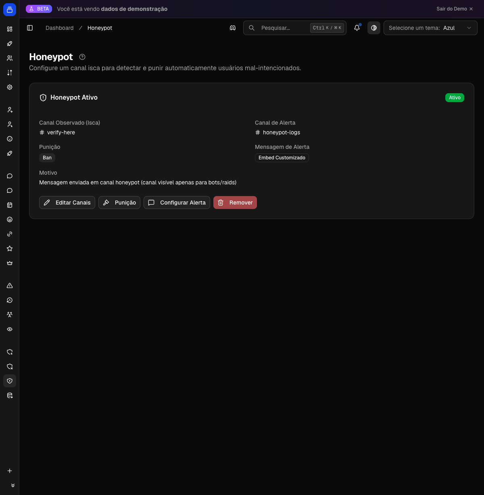

# Honeypot (Canal Isca)

Pegue spammers no flagrante. Você cria um canal onde ninguém deveria escrever, e quem escreve ali é punido na hora, com a mensagem apagada e a equipe avisada.

{ .dx-shot loading=lazy }

*Configuração do honeypot no [Dashboard](https://admin.delfus.app) (exemplo com dados de demonstração).*

## Como funciona

Deixe um canal visível mas onde nenhum membro legítimo deveria postar, tipo um "nao-escreva-aqui" no topo da lista. Membros reais leem o aviso e passam direto. Bots de spam e contas-laranja escrevem em tudo que veem e caem na isca.

Quando alguém morde a isca, o Delfus age em segundos:

1. Apaga a mensagem na hora (se tiver permissão).
2. Pune o autor com a ação que você escolheu: advertir, silenciar, expulsar ou banir.
3. Avisa a equipe no canal de alertas: quem caiu, qual punição levou e em qual canal.
4. Para por aí. A mensagem não passa por triggers, filtros ou contadores. O Honeypot tem prioridade.

!!! example "Exemplo"
    Uma conta nova entra e dispara um print de golpe em vários canais, incluindo o seu "🚫-nao-escreva-aqui". O Delfus apaga a mensagem, silencia o autor por 10 minutos e avisa a staff. Seus membros nem chegam a ver o golpe.

!!! note "Detalhes que valem saber"
    - Bots e mensagens de sistema são sempre ignorados, incluindo o próprio Delfus. Só contas de pessoas reais caem na armadilha.
    - A punição só funciona se o cargo do bot estiver acima do membro na hierarquia. Se não estiver, a mensagem ainda é apagada e o alerta ainda chega, só a punição pode falhar.
    - Sua configuração fica salva no banco e volta sozinha quando o bot reinicia. Configurou uma vez, vale até você desligar.

## Comandos

| Comando | O que faz |
| --- | --- |
| `/honeypot ativar` | Liga o Honeypot definindo o canal isca e o canal de alertas. Já começa silenciando por 10 minutos. Rodar de novo com os mesmos dois canais desliga. |
| `/honeypot acao` | Escolhe o destino de quem cai: advertir, silenciar, expulsar ou banir. No silenciar dá pra definir a duração (de 1 minuto a 28 dias). |
| `/honeypot mensagem` | Personaliza o alerta da equipe: texto simples ou embed (com título e cor). |

!!! note "Sobre os comandos"
    - `acao` e `mensagem` só funcionam depois de ativar com `ativar`.
    - Só administradores podem configurar o Honeypot.
    - Os campos de canal têm autocompletar.

## Configuração

Dá pra configurar de dois jeitos. Os dois mexem na mesma config, então pode misturar.

**Pelo Dashboard (recomendado):** acesse [admin.delfus.app](https://admin.delfus.app), escolha o servidor e abra a página Honeypot. Lá você define os canais (isca e alertas), a punição (ação + duração) e a mensagem de alerta (padrão, texto ou embed).

**Por comando:**

1. Rode `/honeypot ativar` com o canal isca e o canal de alertas. Já fica ativo silenciando por 10 minutos.
2. (Opcional) Ajuste a punição com `/honeypot acao`.
3. (Opcional) Personalize o alerta com `/honeypot mensagem`.

Para desligar: pelo Dashboard, remova a configuração na página. Por comando, rode `/honeypot ativar` de novo com os mesmos dois canais.

!!! tip "Personalizando o alerta"
    No texto ou embed do alerta, use `{user}` pra mencionar quem caiu e `{channel}` pra apontar o canal isca. O Delfus troca pelos valores reais na hora de enviar. Se você criar um embed totalmente vazio, ele volta pro alerta padrão sozinho, pra nunca deixar de avisar.

## Exemplos

!!! example "Pegar spammers no flagrante"
    Crie um canal "🚫-nao-escreva-aqui" no topo da lista e rode `/honeypot ativar` apontando ele como isca e um canal de staff como alertas. Qualquer conta que escrever ali é silenciada por 10 minutos, e a equipe é avisada na hora.

!!! example "Banir contas maliciosas sem moderador online"
    Depois de ativar, rode `/honeypot acao` e escolha Banir. A partir daí, quem cai na armadilha é banido na hora, sem precisar de ninguém da staff acordado às 3 da manhã.

!!! example "Alerta formatado pra equipe"
    Rode `/honeypot mensagem` com tipo embed, título "⚠️ Honeypot acionado" e descrição "O usuário {user} caiu na isca {channel} e foi punido." O aviso chega formatado e já com as menções certas.

## Perguntas frequentes

**O Honeypot pune bots ou o próprio Delfus?**
Não. Bots e mensagens de sistema são sempre ignorados. Só pessoas reais caem.

**Preciso reconfigurar quando o bot reinicia?**
Não. A config fica salva e volta sozinha. Ativou uma vez, vale até você desligar.

**Como desativo?**
Pelo Dashboard, remova a configuração na página. Por comando, rode `/honeypot ativar` de novo com os mesmos dois canais (isca e alertas) que usou pra ativar.

**O membro punido descobre que era uma armadilha?**
A mensagem dele some e a punição é aplicada como qualquer outra moderação. O alerta detalhado vai só pro canal da equipe, nunca pro usuário.

**Quais permissões o bot precisa?**
Ver canais, Ver histórico de mensagens, Gerenciar mensagens (pra apagar) e Moderar membros (pra silenciar). Pra expulsar ou banir, ele também precisa das permissões de Expulsar / Banir membros. E lembre: o cargo do bot precisa estar acima de quem você quer punir.

!!! tip "Dica"
    Coloque o canal isca no topo da lista, com um nome claro de "não escreva aqui". Spammers escrevem nos primeiros canais que veem; membros reais leem o aviso e seguem em frente. Combine com a ação Banir e deixe as contas maliciosas saírem sozinhas, sem depender de moderador online.

