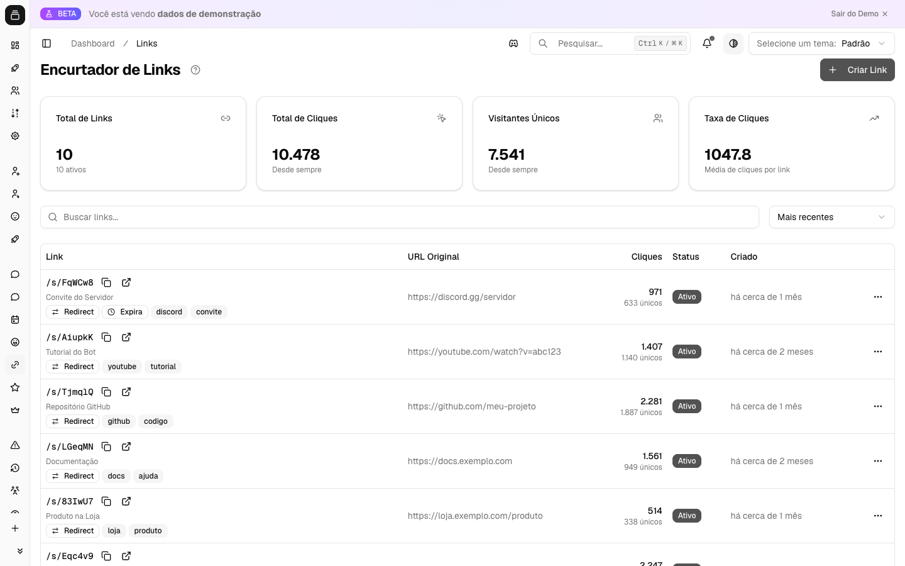

# Encurtador de links

O encurtador transforma URLs longas em links curtos do tipo `link.delfus.app/s/CODIGO`, com rastreamento de cliques completo: país, cidade, dispositivo, navegador, origem do tráfego e muito mais. Além de redirecionar, cada link pode ter senha, data de expiração, limite de cliques, prévia social personalizada (o card que aparece ao colar o link no Discord/Twitter) e até uma **página de destino** (landing page) com cores, imagem e efeitos visuais. É a ferramenta certa para divulgar campanhas, votações e anúncios do seu servidor e saber exatamente de onde vieram os cliques.

{ .dx-shot loading=lazy }

*Encurtador de links no [Dashboard](https://admin.delfus.app) — exemplo com dados de demonstração.*

## Como funciona

O encurtador é gerenciado inteiramente pelo painel web — **não há comando de barra (`/`) no Discord** para essa funcionalidade. O fluxo completo é:

### 1. Criação do link

Você abre o diálogo "Criar Link" e escolhe entre dois tipos:

- **Redirecionamento** — o visitante é levado direto para uma URL de destino que você informa.
- **Landing Page** — em vez de redirecionar, o visitante vê uma página personalizada hospedada pelo Delfus (com título, imagem, cores e efeito visual). Útil para confirmações de voto, anúncios e páginas de agradecimento.

Ao criar, você pode definir:

- A **URL de destino** (obrigatória para links de redirecionamento; o sistema valida que é uma URL válida).
- Um **título** para organização interna (não aparece para o visitante).
- **Tags** separadas por vírgula, para organizar e filtrar a lista depois.
- Um **código personalizado** ou, deixando em branco, o sistema gera um automático.

#### Como o código curto é gerado

- Se você **não** informar um código, o Delfus cria um automaticamente a partir do identificador interno do link, usando codificação Base58. O Base58 evita caracteres ambíguos (não usa `0`, `O` maiúsculo, `I` maiúsculo nem `l` minúsculo), gerando códigos curtos e fáceis de ler. Os primeiros links já saem com cerca de 4 caracteres.
- Se você informar um **código personalizado**, ele precisa ter de **3 a 12 caracteres**, usar apenas caracteres Base58 (letras e números, exceto os ambíguos acima) mais `_` e `-`. Se o código já estiver em uso por outro link, a criação é recusada e você é avisado.

O link final fica disponível em `link.delfus.app/s/CODIGO` (o domínio pode variar conforme a configuração da instalação).

### 2. Vínculo com o servidor

Ao criar um link com um servidor selecionado no painel, o link fica **associado àquele servidor** — assim toda a equipe que tem acesso ao dashboard daquele servidor vê e gerencia os mesmos links. É obrigatório selecionar um servidor antes de criar pelo painel do servidor. Links criados sem um servidor no contexto ficam **pessoais** (vinculados à sua conta, visíveis só para você).

### 3. Acesso (o clique do visitante)

Quando alguém abre o link curto, o Delfus aplica as regras configuradas, nesta ordem:

1. **Limite de acessos por minuto.** Para evitar abuso e robôs, cada combinação de visitante (IP) + link é limitada a **100 acessos por minuto**. Ao estourar esse limite, o visitante recebe temporariamente uma resposta de "muitas requisições" com um tempo de espera até liberar de novo.
2. **Link inexistente.** Se o código não existe, o visitante cai numa página de "não encontrado".
3. **Senha.** Se o link tem senha, o visitante é levado a uma página para digitá-la antes de prosseguir. A senha é guardada de forma cifrada (hash) — nem o Delfus armazena o texto puro.
4. **Página de destino (landing page).** Se for um link desse tipo, o clique é registrado e o visitante vê a página personalizada em vez de ir para uma URL externa.
5. **Redirecionamento normal.** Caso contrário, o clique é registrado e o visitante é redirecionado para a URL de destino. Se o link tiver parâmetros de campanha (UTM) configurados, eles são acrescentados automaticamente à URL final.
6. **Link indisponível.** Se o link está **inativo**, **expirado** (passou da data) ou já **atingiu o limite de cliques**, o visitante vê uma página informando que o link não está mais disponível.

As páginas de redirecionamento e de landing usam cabeçalhos que impedem o navegador de guardar o link em cache e pedem aos buscadores que não as indexem — assim cada acesso é sempre contado e o destino real fica reservado.

### 4. Coleta de dados do clique

A cada acesso válido, o Delfus registra (associando os dados a um identificador anônimo do visitante, derivado do IP + navegador, sem expor a identidade):

- **Localização aproximada**: país, região/estado e cidade, além de fuso horário e provedor de internet, obtidos a partir do IP. Acessos de rede local não geram geolocalização.
- **Dispositivo**: tipo (computador, celular ou tablet), fabricante e modelo quando disponíveis.
- **Navegador e sistema operacional** (com versões).
- **Idioma** do navegador e dimensões de tela/janela quando disponíveis.
- **Origem do tráfego**: o Delfus classifica de onde veio o clique — **rede social** (Facebook, X/Twitter, Instagram, LinkedIn, Reddit, TikTok, YouTube, Discord etc.), **busca** (Google, Bing, Yahoo, DuckDuckGo etc.), **e-mail**, **referência** (outro site) ou **direto** (sem origem identificável).
- **Parâmetros de campanha (UTM)** vindos da URL.
- **Robôs e prévias de links**: acessos de bots, rastreadores e geradores de prévia (WhatsApp, Telegram, Discord, Slack, redes sociais) são identificados e marcados, para você distinguir cliques reais de pré-visualizações automáticas.

**Visitantes únicos** são contados separadamente do total de cliques: se a mesma pessoa abre o link várias vezes, o total sobe a cada vez, mas o "único" conta uma vez só (a unicidade é controlada por 24 horas).

### 5. Estatísticas

No painel você acompanha, para cada link e no geral:

- **Total de cliques** e **cliques únicos** (mantidos quase em tempo real).
- **Evolução por dia** (série temporal) e **distribuição por hora** do dia.
- **Rankings** de país, dispositivo, navegador, sistema operacional e origem do tráfego.
- Um **fluxo de cliques recentes** quase em tempo real (país, dispositivo e navegador dos últimos acessos).

Os contadores são atualizados instantaneamente a cada clique e consolidados em estatísticas diárias periodicamente, então os números aparecem rápido sem sobrecarregar o sistema.

## Comandos

Esta feature é configurada apenas pelo painel. Não há comandos de barra (`/`) no Discord para o encurtador de links.

## Configuração

Toda a gestão é feita pelo Dashboard, em **[https://admin.delfus.app](https://admin.delfus.app)**, na seção de links. Por lá você pode:

- **Criar** links de redirecionamento ou landing pages.
- **Listar** os links com **busca** (por título, código ou URL de destino), **filtro por tag** e **ordenação** (mais recentes, mais antigos, mais cliques, menos cliques, cliques mais recentes). A lista é paginada.
- **Editar** qualquer campo, **ativar/desativar** e **excluir** links.
- Abrir as **estatísticas detalhadas** de cada link.

### Opções ao criar/editar um link

**Campos principais:**

- **Tipo de link**: Redirecionamento ou Landing Page.
- **URL de destino** (obrigatória para redirecionamento).
- **Título** (organização interna).
- **Código personalizado** (3–12 caracteres; Base58 sem `0`, `O`, `I`, `l`, mais `_` e `-`). Em branco = gerado automaticamente.
- **Tags** (separadas por vírgula).

**Opções avançadas — Proteção do link:**

- **Senha** de acesso (até 255 de título; visitantes precisam digitá-la).
- **Data de expiração** (data e hora).
- **Máximo de cliques** (em branco = ilimitado; o link bloqueia ao atingir o número).

**Opções avançadas — Prévia em redes sociais** (apenas para redirecionamento): personalize o card que aparece ao compartilhar o link:

- **Título OG**
- **Descrição OG**
- **Imagem OG** (URL da imagem)

**Opções avançadas — Parâmetros UTM** (apenas para redirecionamento): adicionados automaticamente à URL de destino no redirecionamento, para rastrear campanhas:

- **utm_source**, **utm_medium**, **utm_campaign**, **utm_term**, **utm_content** (cada um até 100 caracteres).

### Configuração da Landing Page

Quando o tipo é Landing Page, você define:

- **Template** (modelo da página):
    - **Confirmação de Voto** — ideal para enquetes e votações.
    - **Anúncio** — para comunicados e novidades.
    - **Agradecimento** — página de "obrigado".
    - **Personalizado** — layout básico customizável.
- **Título** (obrigatório, até 255 caracteres) e **descrição** (até 1000 caracteres).
- **Imagem** (URL).
- **Cores**: cor de fundo, cor do texto e cor de destaque (em formato hexadecimal, ex.: `#1a1a2e`).
- **Efeito visual**: Nenhum, **Confetti**, **Fogos** ou **Brilhos**.
- **Botão de compartilhar** (mostrar ou não) e **marca Delfus** (mostrar ou não a identificação do Delfus na página).

## Requisitos

- É necessário estar **autenticado no painel**. Para gerenciar os links de um servidor, você precisa ter acesso ao dashboard daquele servidor.
- O **bot do Discord não precisa de nenhuma permissão especial** para essa funcionalidade — ela roda no painel/site, não dentro do servidor. Nada precisa ser configurado no Discord.

## Perguntas frequentes

**Posso escolher o final do link (o código)?**
Sim. Informe um código personalizado de 3 a 12 caracteres, usando letras e números (sem os ambíguos `0`, `O`, `I`, `l`), `_` e `-`. Se o código já estiver em uso, escolha outro. Deixando em branco, o sistema gera um curto automaticamente.

**A senha do link é segura?**
A senha não é guardada em texto puro — apenas um hash dela é armazenado. O visitante precisa digitá-la corretamente numa página de desbloqueio antes de chegar ao destino.

**O que acontece quando o link expira ou atinge o limite de cliques?**
Ele para de redirecionar e o visitante passa a ver uma página informando que o link não está mais disponível. O mesmo vale para links desativados manualmente. Você pode reativar ou editar a expiração/limite a qualquer momento pelo painel.

**Como sei de qual divulgação veio cada clique?**
Pelas estatísticas: o Delfus classifica a origem (rede social, busca, e-mail, direto) automaticamente. Para diferenciar campanhas específicas (ex.: post no Twitter vs. mensagem no Discord), use os parâmetros UTM — eles aparecem nas estatísticas e são acrescentados à URL de destino no redirecionamento.

!!! tip "Dica"
    Use os parâmetros UTM ao divulgar o mesmo link em canais diferentes (Twitter, Discord, e-mail): assim o painel mostra exatamente de onde vieram os cliques e qual divulgação trouxe mais gente. E lembre-se: "cliques únicos" contam cada pessoa uma vez por 24 horas, então use esse número para medir alcance real e o "total de cliques" para medir engajamento.

