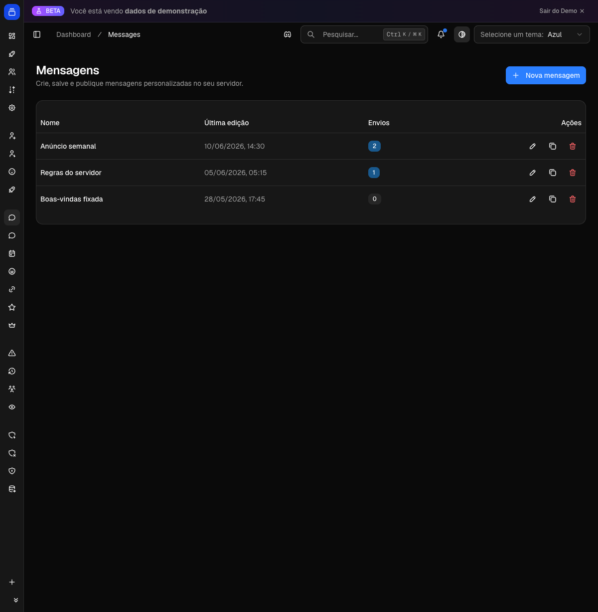

# Mensagens e Embeds

Monte mensagens e embeds completos num editor visual, salve como modelos reutilizáveis e publique no canal que quiser. O bot envia como ele mesmo ou através de um webhook com nome e avatar personalizados. Depois de publicar, dá para editar a mensagem já enviada sem apagar e repostar.

A rota fica em `/dashboard/messages` no painel.

{ .dx-shot loading=lazy }

*Editor de mensagens e embeds no [Dashboard](https://admin.delfus.app) — dados de demonstração.*

## Como funciona

O fluxo tem três etapas: você edita, salva e envia.

**Editar.** O editor é dividido em duas colunas: o formulário à esquerda e uma prévia ao vivo à direita (no desktop; no mobile a prévia abre num painel lateral). Cada alteração no formulário aparece na prévia na hora. O editor tem desfazer/refazer e um contador de caracteres dos embeds. O formulário se divide em quatro seções: Remetente, Conteúdo, Embeds e Botões.

**Salvar.** Toda mensagem é salva com um nome (ex.: "Boas-vindas", "Regras", "Anúncio"). O modelo salvo guarda todo o conteúdo e fica disponível para reenviar ou editar depois. Você precisa salvar antes de poder enviar.

**Enviar.** Ao enviar, você escolhe o canal de destino e o modo (Bot ou Webhook). O painel chama o bot, que entrega a mensagem no canal e devolve o link do Discord. Cada envio vira um registro na lista "Envios" da mensagem, com canal, modo e data. A partir desse registro você consegue reenviar para atualizar a mensagem publicada.

Não há agendamento. O envio é imediato — você clica em Enviar e a mensagem aparece no canal.

### Modos de envio

| Modo | Quem aparece como autor | Quando usar |
| --- | --- | --- |
| **Bot** | O próprio bot Delfus (nome e avatar do bot) | Anúncios oficiais, mensagens do servidor |
| **Webhook** | Nome e avatar que você definir na seção Remetente | Personalizar a identidade do remetente |

No modo Webhook você pode definir um **Nome** (até 80 caracteres) e uma **URL de avatar**. O nome não pode conter "clyde" nem "discord", nem ser "everyone" ou "here" — são restrições do Discord. No modo Bot esses campos ficam indisponíveis.

### Como o bot entrega

Quando você confirma o envio, o painel manda os dados para o bot. O bot localiza o servidor no shard correto, resolve as variáveis, confere se tem as permissões necessárias e então envia.

No modo **Bot**, ele posta direto no canal. No modo **Webhook**, ele procura um webhook chamado "Delfus" no canal e cria um caso não exista. Para editar uma mensagem enviada por webhook, o bot reusa o mesmo webhook.

Canais de texto, de anúncio e threads recebem mensagens. Em threads, o webhook fica no canal-pai e a mensagem é postada dentro da thread.

Se faltar permissão, o bot recusa o envio e informa o que está faltando. Permissões exigidas: Ver Canal, Enviar Mensagens (ou Enviar Mensagens em Threads), Inserir Links. No modo Webhook, também Gerenciar Webhooks.

## Configuração

### Conteúdo

Texto simples da mensagem, acima dos embeds. Até 2000 caracteres. Aceita a formatação Markdown do Discord. A mensagem precisa ter pelo menos uma destas coisas: texto, um embed ou um botão.

### Embeds

Até 10 embeds por mensagem. Cada embed pode ter:

- **Título** (até 256) e **URL** do título
- **Descrição** (até 4096)
- **Cor** da barra lateral
- **Autor**: nome (até 256), URL e ícone
- **Rodapé**: texto (até 2048) e ícone, mais um **timestamp**
- **Imagem** e **thumbnail** (por URL)
- **Campos** (até 25): cada um com nome (até 256), valor (até 1024) e a opção de exibir lado a lado (inline)

A soma de todos os textos dos embeds (títulos, descrições, rodapés, nomes de autor, nomes e valores de campos) não pode passar de 6000 caracteres no total. O contador no topo do editor mostra esse valor e fica vermelho quando estoura.

### Botões

Botões de link, organizados em até 5 linhas com até 5 botões cada. Cada botão tem um rótulo (até 80 caracteres), uma URL de destino e, opcionalmente, um emoji. São botões de link — levam a uma URL externa, não disparam ações no bot.

### Variáveis

Use variáveis no texto e nos embeds. O bot as substitui pelos valores reais no momento do envio. Na prévia do editor elas aparecem com valores de exemplo.

| Variável | Substituída por | Exemplo |
| --- | --- | --- |
| `{{server}}` | Nome do servidor | Delfus Community |
| `{{memberCount}}` | Quantidade de membros | 1234 |
| `{{serverIcon}}` | URL do ícone do servidor | (link do ícone) |

O botão **Variáveis** na barra do editor lista todas e copia o token com um clique. As variáveis funcionam em qualquer campo de texto — conteúdo, título, descrição, campos, rodapé.

### Importar/Exportar JSON

O editor tem um diálogo de JSON para colar ou copiar a estrutura completa da mensagem. Útil para reaproveitar uma mensagem montada em outra ferramenta ou versionar o conteúdo fora do painel.

### Limites de uma olhada

| Item | Limite |
| --- | --- |
| Texto da mensagem | 2000 |
| Embeds por mensagem | 10 |
| Título do embed | 256 |
| Descrição do embed | 4096 |
| Campos por embed | 25 |
| Nome do campo | 256 |
| Valor do campo | 1024 |
| Rodapé | 2048 |
| Total de texto (todos os embeds) | 6000 |
| Linhas de botões | 5 |
| Botões por linha | 5 |
| Rótulo do botão | 80 |
| Nome do webhook | 80 |

## Exemplos

!!! example "Anúncio simples como o bot"
    1. Em `/dashboard/messages`, crie uma nova mensagem e dê um nome ("Anúncio").
    2. Na seção Conteúdo, escreva o texto. Use `{{server}}` para inserir o nome do servidor.
    3. Salve.
    4. Clique em Enviar, escolha o canal, deixe o modo em **Bot** e confirme.
    5. Use "Ver no Discord" no aviso de sucesso para conferir.

!!! example "Mensagem de regras com embed e webhook personalizado"
    1. Crie a mensagem e abra a seção Remetente. Troque para **Webhook** e defina Nome ("Regras do Servidor") e a URL de um avatar.
    2. Em Embeds, adicione um embed com título, descrição e uma cor. Inclua campos para cada regra.
    3. Em Botões, adicione um botão de link ("Servidor" → URL do convite).
    4. Salve e envie no modo Webhook.

!!! example "Atualizar uma mensagem já publicada"
    1. Abra a mensagem salva. Edite o que precisar (texto, embed, botões).
    2. Salve.
    3. No card **Envios**, clique em **Atualizar publicação** no envio que quer atualizar.
    4. O bot reedita a mensagem original no mesmo canal e modo, sem repostar.

## Perguntas frequentes

**Consigo agendar o envio?**
Não. O envio é imediato. O fluxo é salvar o modelo e enviar quando quiser.

**A mensagem publicada some se eu editar o modelo no painel?**
Não. Editar o modelo salvo não toca na mensagem já publicada. Para refletir as mudanças no Discord, use **Atualizar publicação** no card Envios.

**Posso enviar a mesma mensagem para vários canais?**
Sim. Cada envio cria um registro próprio. Envie de novo escolhendo outro canal e cada publicação fica listada separadamente em Envios.

**Por que o envio falhou por permissão?**
O bot precisa de Ver Canal, Enviar Mensagens (ou Enviar Mensagens em Threads) e Inserir Links no canal de destino. No modo Webhook, também Gerenciar Webhooks. A mensagem de erro indica o que falta.

**Posso editar uma mensagem que foi apagada no Discord?**
Não. Se a mensagem original foi removida, o bot avisa que ela não existe mais. Envie uma nova.

**Qual a diferença entre Bot e Webhook?**
No modo Bot a mensagem aparece como o bot Delfus. No modo Webhook ela aparece com o nome e avatar que você definir. O conteúdo é o mesmo; muda só a identidade do remetente.

**As variáveis funcionam dentro dos embeds e botões?**
Sim. O bot resolve as variáveis em qualquer campo de texto da mensagem no momento do envio.

