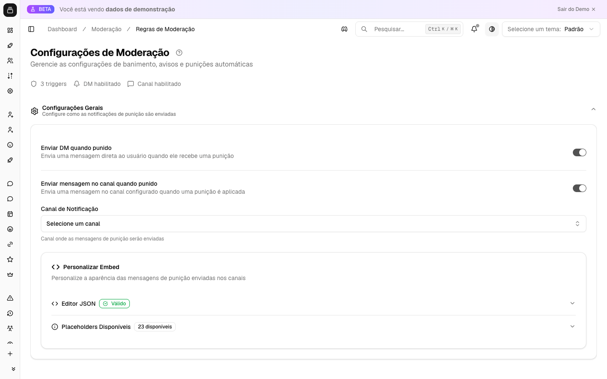

# Moderação e punições

O Delfus oferece um sistema completo de moderação para o seu servidor: advertências (warns) com gatilhos automáticos, silenciamento, expulsão e banimento — tudo registrado em um histórico permanente, com notificação opcional ao usuário punido e ao canal de logs da staff.

{ .dx-shot loading=lazy }

*Configuração de moderação no [Dashboard](https://admin.delfus.app) — exemplo com dados de demonstração.*

## Como funciona

Toda punição parte de um comando da staff e segue um fluxo padronizado:

1. **A staff executa o comando** (`/warn`, `/mute`, `/ban`, etc.) informando o usuário, o motivo e, quando aplicável, a duração.
2. **O bot valida as permissões** antes de qualquer ação: confere se quem executou e o próprio bot têm hierarquia de cargo suficiente para punir o alvo. Não é possível punir a si mesmo nem outro bot.
3. **Banimento, silêncio e expulsão pedem confirmação**: o bot mostra um resumo da punição com botões **Confirmar** / **Cancelar**, evitando ações acidentais. Advertências são aplicadas direto.
4. **A punição é aplicada** usando os recursos nativos do Discord (timeout para silêncio, kick, ban). Bans apagam as mensagens recentes do usuário das últimas 24 horas.
5. **O usuário punido recebe um aviso por mensagem direta (DM)** — desde que esse aviso esteja ativado para aquele tipo de punição. A DM é sempre enviada **antes** da expulsão/ban (senão o usuário perderia o acesso ao bot) e pode incluir um link de apelação. Se o usuário estiver com as DMs fechadas, o bot informa isso à staff sem falhar a punição.
6. **Um aviso pode ser enviado ao canal de logs da staff**, se configurado.
7. **Tudo fica registrado no histórico** do usuário (quem puniu, motivo, duração, se a DM foi entregue).

### Advertências com gatilhos automáticos

As advertências (warns) acumulam um contador por usuário. Você pode configurar **gatilhos**: ao atingir um número X de warns, o bot executa automaticamente uma ação — silenciar, expulsar, banir, adicionar ou remover um cargo. Ao advertir, a staff vê uma barra de progresso indicando quantos warns faltam para o próximo gatilho e qual ação ele dispara.

### Expiração automática de warns ("bom comportamento")

Se ativada, uma rotina periódica do bot **remove advertências antigas** após o período que você definir (ex.: 30 dias). Quando os warns de um usuário expiram:

- O contador é zerado/reduzido.
- Se um warn expirado tinha disparado um gatilho de "adicionar cargo", esse cargo é **removido automaticamente** caso a contagem caia abaixo do limite. (Gatilhos de "remover cargo" não são revertidos.)
- O bot pode enviar uma mensagem de reconhecimento de bom comportamento no canal de logs.

### Histórico e registro de ações da staff

- O comando `/warnlist` mostra o histórico de punições de um usuário.
- Comandos de moderação também alimentam o **registro de ações (action log)**: o bot publica em um canal de auditoria os eventos do servidor (mensagens apagadas, bans, mudanças de cargo, timeouts, etc.), cruzando com o log de auditoria do Discord para identificar quem fez a ação. Eventos que ocorrem em rajada são agrupados para não poluir o canal.

## Configuração

A maior parte da configuração é feita pelo **Dashboard** em [https://admin.delfus.app](https://admin.delfus.app), na seção de **Moderação**:

- Ativar/desativar o aviso por DM para cada tipo de punição (advertência, silêncio, expulsão, banimento e suas reversões).
- Definir o **canal de logs** das punições e se as notificações são enviadas nele.
- Configurar os **gatilhos automáticos de warns** (quantos warns → qual ação).
- Ativar a **expiração automática de warns** e definir a duração (dias, semanas ou meses).
- Definir um **link de apelação** incluído nas DMs de punição.
- Personalizar os textos/embeds enviados ao usuário em cada tipo de punição.
- Configurar o **registro de ações (action log)**: canal, quais eventos registrar, cargos/canais ignorados.

As punições em si são aplicadas pelos comandos de barra dentro do Discord:

- `/warn` — advertir um usuário
- `/unwarn` — remover uma advertência
- `/warnlist` — ver o histórico de punições de um usuário
- `/mute` — silenciar (com duração opcional)
- `/unmute` — remover o silêncio
- `/ban` — banir (permanente ou temporário)
- `/kick` — expulsar

## Requisitos

- O bot precisa das permissões correspondentes a cada ação: **Moderar membros** (para warn/mute), **Expulsar membros** (kick) e **Banir membros** (ban).
- A **hierarquia de cargos** importa: o cargo do bot e o de quem executa o comando precisam estar **acima** do cargo do usuário a ser punido.
- Para o registro de ações funcionar, o bot precisa de **Ver canal**, **Enviar mensagens**, **Inserir links** e **Anexar arquivos** no canal de logs, além de acesso ao log de auditoria do servidor.

!!! tip
    Configure os gatilhos de warn em vez de banir manualmente: assim a punição é consistente e a staff só precisa advertir. Combine com a expiração automática para dar uma "segunda chance" a quem se comportar bem.

