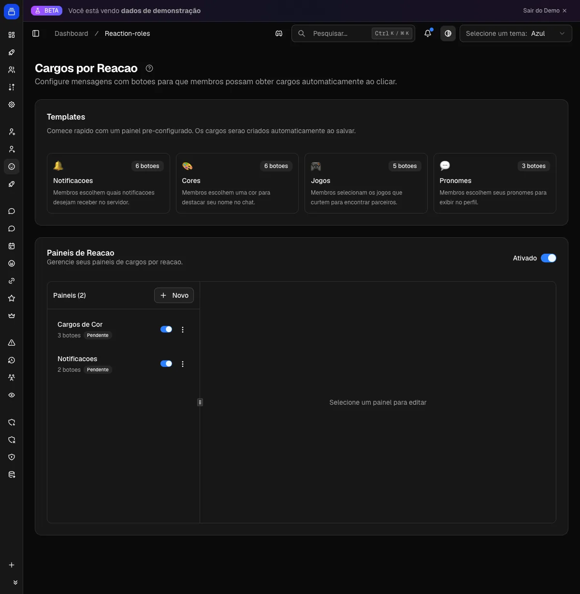

# Cargos por reação (reaction roles)

Seus membros pegam e largam cargos sozinhos, num clique, sem pedir nada a um moderador. Você publica um painel de botões do Delfus num canal do Discord e cada um se serve: cargos de notificação, cores, pronomes, jogos, regiões, acesso a áreas do servidor. Seus canais de aviso ficam só com quem quer estar lá.

{ .dx-shot width="1200" height="1227" fetchpriority=high }

*Cargos por reação no [Dashboard](https://admin.delfus.app) (exemplo com dados de demonstração).*

## Como funciona

Você cria um **painel**: uma mensagem que o bot publica num canal. Ela pode ter texto, um embed (título, descrição, cor, imagem) e os **botões**, cada botão amarrado a um cargo.

O membro clica e o bot resolve. Cada botão é um interruptor: o mesmo botão dá e tira o cargo. Não tem o cargo, clicar adiciona; já tem, clicar remove.

Ao clicar, o membro recebe uma confirmação privada (só ele vê, e ela some sozinha) dizendo o que aconteceu. A confirmação é instantânea. O cargo entra logo depois, em segundo plano, normalmente em poucos segundos.

!!! example "Exemplo"
    Você abre um painel de notificações e 200 pessoas clicam ao mesmo tempo. Cada uma vê na hora a mensagem "Você recebeu o cargo **Eventos**!", e o bot aplica os cargos em fila, sem travar nem apanhar do Discord. Ninguém espera tela de carregamento.

!!! note "Por baixo dos panos"
    O bot processa os cliques com controle de ritmo e tenta de novo sozinho se houver instabilidade momentânea. Cliques duplicados em sequência rápida são ignorados, pra não ficar dando e tirando o cargo várias vezes. Tudo automático.

### Escolha única (modo exclusivo)

Todo painel tem o botão **"Permitir múltiplos cargos"**:

- **Ligado** (padrão): o membro acumula vários cargos do painel ao mesmo tempo. Bom pra notificações, jogos e pronomes, onde faz sentido marcar várias opções.
- **Desligado**: vira escolha única. Ao pegar um cargo do painel, o bot tira sozinho os outros do mesmo painel. Bom pra cor do nome, região e plataforma, onde só pode existir uma.

!!! note
    O modo exclusivo só mexe nos cargos **daquele painel**. Cargos de outros painéis, ou que o membro ganhou de outras formas, ficam intocados.

## Comandos

Essa feature não tem comando de barra. Criar painéis, botões, cargos, mensagens e publicar acontece tudo no [Dashboard](https://admin.delfus.app), na seção **Cargos por Reação**.

## Configuração

Toda a montagem é pelo [Dashboard](https://admin.delfus.app):

1. **Ligue o sistema** no interruptor geral no topo da página. Ele liga e desliga todos os painéis de uma vez. Com tudo desligado, os botões param de entregar cargos e o membro vê um aviso ao clicar.
2. **Crie um painel**, do zero em "Novo Painel" ou a partir de um **template** pronto: **Notificações**, **Cores** (já em escolha única), **Jogos** ou **Pronomes**. Se o template usar cargos que ainda não existem, o bot cria eles pra você ao salvar, já com nome e cor sugeridos.
3. **Configure o painel**: dê um nome (só pra você achar na lista), escolha o canal de destino (texto ou anúncios), escreva o conteúdo e monte a lista de botões.
4. **Salve**. O bot publica a mensagem no canal. Se você editar depois, ele atualiza a mesma mensagem em vez de criar outra. Se alguém apagou a mensagem nesse meio-tempo, ele percebe e publica uma nova.

Cada botão tem **emoji** (opcional), **rótulo**, **cargo** e **cor** (azul, cinza, verde ou vermelho).

Você também personaliza as **mensagens de confirmação** que o membro recebe ao ganhar e ao perder um cargo. Use `{cargo}` pra inserir o nome automaticamente:

!!! example "Exemplo"
    Em vez do padrão "Você recebeu o cargo **Lives**!", escreva `Pronto! Agora você é avisado toda vez que rolar uma {cargo}.`

!!! tip "Organizar painéis"
    Na lista você ativa e desativa cada painel individualmente, **duplica** um (sai uma cópia "(copia)" pronta pra ajustar) e **exclui** o que não usa mais.

!!! note "Limites"
    Até **25 botões** por painel (5 linhas de 5). Texto acima do embed: 2000 caracteres. Mensagens de confirmação: 500 cada. Nome do painel: 100.

## Exemplos

!!! example "Central de notificações (acúmulo livre)"
    Crie um painel "Central de Notificações" com os botões **Anúncios**, **Eventos**, **Transmissões** e **Votações**, cada um num cargo de menção. Deixe **"Permitir múltiplos cargos" ligado**, já que dá pra querer ser avisado de várias coisas. Quem quer ser marcado em anúncios, clica e pronto.

!!! example "Cor do nome (escolha única)"
    Use o template **Cores** ou monte um painel com um botão por cor e **desligue "Permitir múltiplos cargos"**. Escolher uma cor nova remove a anterior sozinha, sem ninguém ficar com duas cores brigando. Lembre de arrastar esses cargos de cor pra cima dos demais na lista de cargos, pra cor aparecer no nome.

!!! example "Pronomes, sem pedir a ninguém"
    Publique um painel "Pronomes" (Ele/Dele, Ela/Dela, Elu/Delu) com emojis. Deixe acúmulo livre pra permitir combinações, ou escolha única pra uma seleção só. Cada um se identifica sozinho, sem ticket e sem moderador.

## Perguntas frequentes

### O mesmo botão dá e tira o cargo?
Sim, é um liga/desliga. Não tem o cargo, clicar adiciona; já tem, clicar remove. A confirmação avisa o que aconteceu.

### Por que o cargo demora alguns instantes pra aparecer?
A confirmação é na hora, mas o cargo é aplicado em segundo plano, em fila, pro servidor aguentar muita gente clicando junto. Costuma entrar em poucos segundos.

### Como faço um menu de uma opção só (uma cor só)?
Desligue o "Permitir múltiplos cargos" do painel. Escolher uma opção passa a remover as outras automaticamente.

### Editei o painel, preciso apagar a mensagem antiga e publicar de novo?
Não. Ao salvar, o bot atualiza a mensagem que já está lá. Só publica uma nova se a antiga tiver sido apagada do canal.

### O bot não está entregando um cargo. Por quê?
Quase sempre é hierarquia: o bot só mexe em cargos que estão **abaixo** dele na lista de cargos do servidor. Se o cargo do botão estiver igual ou acima do cargo do bot, o Discord não deixa e a ação é ignorada. Confira também se o bot tem a permissão **Gerenciar Cargos** e consegue **enviar mensagens** no canal do painel.

!!! tip "Dica"
    Quer cargos de cor sem criar nada na mão? Use o template **Cores**: já vem em escolha única e o bot cria os cargos coloridos sozinho ao salvar. Depois é só arrastar esses cargos pra cima dos demais na lista, e a cor aparece no nome dos membros.
