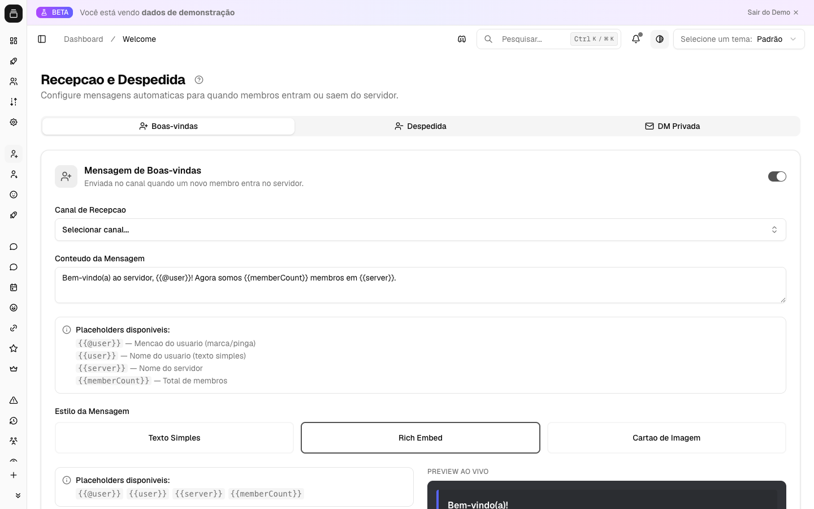

# Boas-vindas e despedida

Sabe aquela sensação boa de chegar num lugar e ser recebido pelo nome? O Delfus faz isso por você, no automático. Toda vez que alguém entra no servidor, ele dá as boas-vindas. E quando alguém sai, ele avisa. Você configura uma vez e nunca mais precisa digitar nada à mão.

As mensagens podem ser um texto simples, um cartão organizado do Discord (embed) ou até uma **imagem feita na hora com o avatar da pessoa**. Dá pra mandar boas-vindas no canal, no privado (DM) da pessoa, ou os dois.

{ .dx-shot loading=lazy }

*Configuração de boas-vindas no [Dashboard](https://admin.delfus.app) — exemplo com dados de demonstração.*

## Como funciona

São **três tipos de mensagem**, e cada um liga ou desliga por conta própria:

- **Boas-vindas no canal** — aparece num canal que você escolhe quando alguém entra.
- **DM de boas-vindas** — chega no privado do novo membro assim que ele entra.
- **Despedida no canal** — aparece num canal quando alguém sai.

Você pode usar um, dois, os três, ou nenhum. Eles são independentes.

Quando alguém entra, o Delfus já atualiza a contagem de membros do servidor e dispara as boas-vindas que estiverem ativas — a do canal e a DM. Quando alguém sai, ele faz o mesmo e posta a despedida, se você tiver ligado.

!!! example "Exemplo"
    Imagine que a Ana acabou de entrar no seu servidor. Em segundos, aparece no canal de boas-vindas: *"Bem-vinda, Ana! Você é o membro nº 1.240 do nosso servidor."* — com o avatar dela num cartão bonito. E no privado dela chega uma mensagem com os primeiros passos. Tudo sem você levantar um dedo.

### Os três formatos

Cada tipo de mensagem aceita formatos diferentes:

| Tipo | Texto | Embed | Cartão de imagem |
| --- | :---: | :---: | :---: |
| Boas-vindas no canal | sim | sim | sim |
| DM de boas-vindas | sim | sim | não |
| Despedida no canal | sim | sim | não |

- **Texto** — uma mensagem simples, de uma ou várias linhas.
- **Embed** — aquele cartão organizado do Discord, com título, cor, imagem, rodapé e tudo mais.
- **Cartão de imagem** — uma imagem gerada na hora com o avatar do membro. É exclusivo das boas-vindas no canal.

!!! note "Por que a despedida não tem DM nem cartão?"
    Porque a pessoa já saiu — não dá pra mandar DM pra quem foi embora. Despedida é só texto ou embed.

### Atalhos que se preenchem sozinhos

Você escreve a mensagem usando alguns atalhos, e o Delfus troca pelos dados reais na hora de enviar:

- `{{@user}}` — **menciona** a pessoa (com notificação). No cartão de imagem, vira só o nome.
- `{{user}}` — o nome da pessoa (apelido ou usuário).
- `{{server}}` — o nome do seu servidor.
- `{{memberCount}}` — quantos membros o servidor tem naquele momento.

### O cartão de imagem

O cartão é uma imagem de 960×540 px com o avatar do membro num círculo. Você escolhe um de **três layouts**:

- **Centralizado** — avatar no meio, título e subtítulo embaixo.
- **À esquerda** — avatar à esquerda, textos ao lado.
- **Minimalista** — sem avatar, só o título grande, uma linha colorida e o subtítulo.

E dá pra ajustar título, subtítulo, cores, fonte (Inter, Roboto, Poppins, Montserrat, Open Sans ou Lato), uma imagem de fundo por URL, sombra no texto e a cor de destaque do avatar. Se travar nas cores, há **predefinições prontas** (Blurple, Oceano, Pôr do Sol, Floresta, Escuro, Rosa Neon, Ouro, Ártico, Lavanda, Vermelho) pra aplicar com um clique.

!!! tip "Texto difícil de ler sobre a imagem de fundo?"
    Aumente a opacidade do overlay (a camada de cor por cima do fundo) ou ligue a sombra do texto. Resolve na hora.

### Botões de link

Nas boas-vindas do canal você pode adicionar **até 3 botões** com link — tipo "Leia as regras" ou "Site oficial". Cada botão tem um nome e uma URL. Isso só existe nas boas-vindas do canal, não na DM nem na despedida.

## Comandos

| Comando | O que faz |
| --- | --- |
| `/welcome teste tipo:<Welcome \| Farewell \| DM>` | Mostra uma **prévia** de uma das três mensagens, usando você como exemplo, sem precisar esperar ninguém entrar ou sair. Só você vê. |

A prévia respeita exatamente o que você configurou: gera o cartão de imagem de verdade, monta o embed real, troca os atalhos pelos seus dados. Se o tipo escolhido ainda não estiver configurado, o bot avisa pra você configurar pelo painel primeiro.

## Configuração

Tudo é feito no **Dashboard** em [admin.delfus.app](https://admin.delfus.app), na seção de boas-vindas e despedida. Cada tipo se configura separado.

**Boas-vindas no canal:**

1. Ative o toggle.
2. Escolha o canal.
3. Escolha o formato (texto, embed ou cartão).
4. Escreva o conteúdo ou monte o cartão. Use os atalhos à vontade.
5. (Opcional) Adicione até 3 botões de link.
6. Decida se quer **ignorar bots**.

**DM de boas-vindas:**

1. Ative o toggle.
2. Escolha o formato (texto ou embed).
3. Escreva o conteúdo. (Aqui não tem botões nem a opção de ignorar bots.)

**Despedida no canal:**

1. Ative o toggle.
2. Escolha o canal.
3. Escolha o formato (texto ou embed).
4. Escreva o conteúdo.
5. Decida se quer **ignorar bots**.

!!! warning "Antes de soltar pra geral"
    Rode `/welcome teste` dentro do servidor pra conferir como ficou. A prévia já mostra o resultado real, com o seu avatar.

## Exemplos

!!! example "Receber com um cartão visual"
    Ative as boas-vindas no canal, escolha o formato **cartão**, defina o título `Bem-vindo, {{user}}!` e o subtítulo `Você é o membro nº {{memberCount}} do {{server}}`. Pegue o layout centralizado, aplique uma predefinição de cores e adicione um botão "Leia as regras" apontando pro canal de regras. Rode `/welcome teste tipo:Welcome` e veja o cartão pronto.

!!! example "Mandar um guia no privado"
    Imagine que você quer orientar quem chega sem poluir os canais. Ative a **DM de boas-vindas** em formato embed, com uma descrição tipo `Olá {{user}}, seja bem-vindo ao {{server}}!` e os primeiros passos do servidor. Cada novo membro recebe isso direto no privado.

!!! example "Anunciar saídas só pra staff"
    Quer registrar quem sai sem alarde? Ative a **despedida** em texto simples, num canal de logs da staff, com `{{user}} deixou o servidor. Agora somos {{memberCount}} membros.` Ligue **ignorar bots** pra não anunciar entrada e saída de robôs.

## Perguntas frequentes

**Posso ter cartão de imagem na despedida ou na DM?**
Não. O cartão é exclusivo das boas-vindas no canal. Despedida e DM aceitam só texto ou embed.

**Por que alguns membros não recebem a DM?**
Porque eles bloqueiam mensagens privadas de gente do servidor. O bot tenta enviar e, se não der, ignora sem erro nenhum.

**A opção "ignorar bots" vale pra DM também?**
Não. Ela vale pras boas-vindas do canal e pra despedida. A DM não tem essa opção (mas, na prática, bots quase nunca aceitam DM).

**Quantos botões de link posso colocar?**
Até 3 — e só nas boas-vindas do canal.

**E se o canal escolhido for apagado?**
O Delfus só pula a mensagem em silêncio, sem dar erro visível. Vale lembrar que ele precisa ter permissão pra enviar mensagens (e imagens/embeds) no canal. Pro comando `/welcome teste`, quem roda precisa ser Administrador e o bot precisa da permissão Gerenciar Servidor.

!!! tip "Dica"
    Monte o cartão e rode `/welcome teste tipo:Welcome` antes de ativar pra todos. A prévia gera o cartão real com o seu avatar, então você vê exatamente como vai ficar — inclusive se o texto está legível sobre a imagem de fundo.

