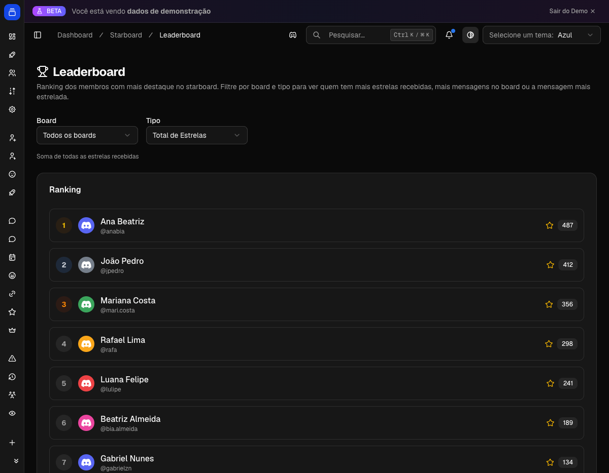

# Starboard

Republique automaticamente as melhores mensagens do servidor num canal de destaques. Quando uma mensagem junta estrelas suficientes (ou o emoji que você escolher), o Delfus copia ela pra lá. Bom pra premiar memes, arte, prints e momentos marcantes.

{ .dx-shot loading=lazy }

*Ranking do Starboard no [Dashboard](https://admin.delfus.app) (dados de demonstração).*

## Como funciona

A galera reage numa mensagem. Se ela bater o mínimo de estrelas, o Delfus copia ela pro canal de destaques num cartão. Conforme mais gente vota, o cartão atualiza a contagem.

Tudo gira em torno de **murais**. Cada mural tem:

- um nome
- um ou mais emojis de voto (não precisa ser ⭐)
- um canal de destino
- um número mínimo de estrelas pra entrar

Você pode ter vários murais ao mesmo tempo: um pros melhores memes, outro pras mensagens marcantes, e assim por diante.

!!! example "Exemplo"
    Alguém posta um meme no `#geral`. Os amigos reagem com ⭐. Na quinta estrela, o Delfus republica o meme no `#destaques` com um cartão mostrando o autor, o conteúdo e a contagem de estrelas. Quem não viu na hora, vê agora.

### Quando as estrelas caem

Se as pessoas tirarem a reação (ou o post levar votos negativos) e a pontuação cair muito, o destaque é removido do canal.

O limite de saída é separado do de entrada, pra evitar que o post fique piscando perto da borda. Você cria uma zona de segurança: entra com 5, mas só sai abaixo de 3.

### Recursos que valem conhecer

Camadas extras que você liga conforme a necessidade:

- **Pesos e votos negativos**: cada emoji pode valer mais (ou menos) de um ponto, e dá pra ter emojis que descontam pontos.
- **Níveis visuais**: conforme a pontuação sobe, o cartão troca de emoji e de cor. Os mais votados ficam mais chamativos.
- **Ranking e cargos de recompensa**: quem mais aparece no mural junta estrelas e pode ganhar cargos automáticos.
- **Reset periódico**: zere o ranking de tempos em tempos pra recomeçar a competição.
- **Hall da Fama**: uma coleção permanente, curada pela moderação, que nunca some.

## Comandos

| Comando | O que faz |
| --- | --- |
| `/starboard` | Mostra as estrelas de um membro: total, quantas vezes apareceu no destaque e melhor pontuação. Sem argumento, mostra as suas; com um usuário, as de outra pessoa. |
| `/hall-of-fame` | Exibe o Hall da Fama do servidor, com navegação por páginas. |
| **Forçar no Starboard** | Envia uma mensagem ao destaque mesmo sem os votos. Com vários murais, você escolhe o destino. Pede **Gerenciar Mensagens**. |
| **Adicionar ao Hall da Fama** | Eterniza a mensagem no Hall da Fama. Pede **Gerenciar Mensagens**. |

!!! note "Onde ficam os dois últimos"
    Não são comandos de barra. Acesse clicando com o **botão direito** numa mensagem → **Apps**.

## Configuração

Tudo pelo **Dashboard** em [admin.delfus.app](https://admin.delfus.app), na seção **Starboard**. É lá que você cria e ajusta os murais.

O essencial pra começar:

1. Crie um mural, dê um nome e aponte pro **canal de destino**.
2. Escolha o **emoji de voto** (⭐ é o clássico).
3. Defina **quantas estrelas** pra entrar e abaixo de quantas pra sair.
4. Deixe o mural **ativo**. Pronto.

A partir daí, refine o quanto quiser:

- **Cartão**: como mostrar o autor, avatar, link pra mensagem original, anexos e tamanho do texto.
- **Filtros**: ignorar reações de bots, bloquear auto-voto, limitar spam de votos, e listas de bloqueio/permissão por usuário, cargo ou canal.
- **Auto-estrela**: em canais escolhidos, o bot reage sozinho nas mensagens, ou manda direto pro destaque sem precisar de votos.
- **Cargos de recompensa**: entregue cargos automáticos por metas (total de estrelas, mensagem mais estrelada, etc.).
- **Reset de ranking**: zere a disputa a cada N dias ou num dia fixo do mês.
- **Hall da Fama**: defina um canal opcional onde as entradas curadas são republicadas em dourado.

!!! warning "Permissões do bot"
    O Delfus precisa de **Ver Canal**, **Enviar Mensagens** e **Incorporar Links** nos canais de destaque. Pra remover reações inválidas ou usar auto-estrela com apagamento, precisa de **Gerenciar Mensagens**. Pra dar cargos de recompensa, precisa de **Gerenciar Cargos**, e o cargo dele tem que estar **acima** dos cargos de recompensa.

## Exemplos

!!! example "Mural clássico de estrelas"
    Crie um mural "Destaques" apontando pro `#destaques`, use ⭐ com entrar em 5 e sair abaixo de 3, e ligue "remover reações inválidas". Toda mensagem que juntar 5 ⭐ vai parar lá, e some se as estrelas caírem demais.

!!! example "Canal de arte no automático"
    No `#arte`, configure a auto-estrela pro Delfus já reagir com ⭐ em toda mensagem **com imagem**, e ligue "apagar inválidas" pra manter o canal só com arte. As reações dos membros decidem o que sobe ao destaque.

!!! example "Competição mensal com prêmio"
    Ligue um reset "dia fixo do mês" pra zerar a disputa toda virada de mês, e crie um cargo "Estrela do Mês" com meta de 100 estrelas. O Delfus dá e tira o cargo sozinho conforme o ranking muda.

!!! example "Hall da Fama curado"
    Apareceu uma mensagem icônica? Um moderador clica com o botão direito → **Apps** → **Adicionar ao Hall da Fama**. Ela fica eternizada, não importa o que aconteça com os votos.

## Perguntas frequentes

**Posso ter mais de um mural no mesmo servidor?**
Sim, quantos quiser, cada um com seu emoji, canal e limites. Se quiser que uma mensagem apareça em só um mural de um grupo, use **grupos exclusivos** (o de maior prioridade vence).

**Dá pra destacar uma mensagem antiga na mão?**
Dá. Um moderador clica com o botão direito → **Apps** → **Forçar no Starboard**, e ela vai pro destaque mesmo sem os votos.

**E se as estrelas caírem depois que a mensagem já entrou?**
O cartão se atualiza a cada mudança. Se a pontuação cair até o **limite de saída**, o destaque é retirado. Por isso vale deixar esse limite abaixo do de entrada.

**Por que minha reação não contou?**
Pode ser auto-voto (com auto-voto desligado), uma reação de bot, voto acima do limite anti-spam, alguém numa lista de bloqueio, ou a mensagem não passou nos filtros (muito nova, muito antiga ou texto curto). Em murais com "remover reações inválidas", a reação é tirada nesses casos.

!!! tip "Dica"
    Deixe **estrelas para entrar** maior que **estrelas para sair** (ex.: entra com 5, sai abaixo de 3) pra criar uma zona de segurança e evitar o post piscando perto do limite. E combine **votos negativos** com **níveis visuais**: os destaques muito votados ganham um cartão mais chamativo, enquanto os negativos derrubam o que não merece ficar.

