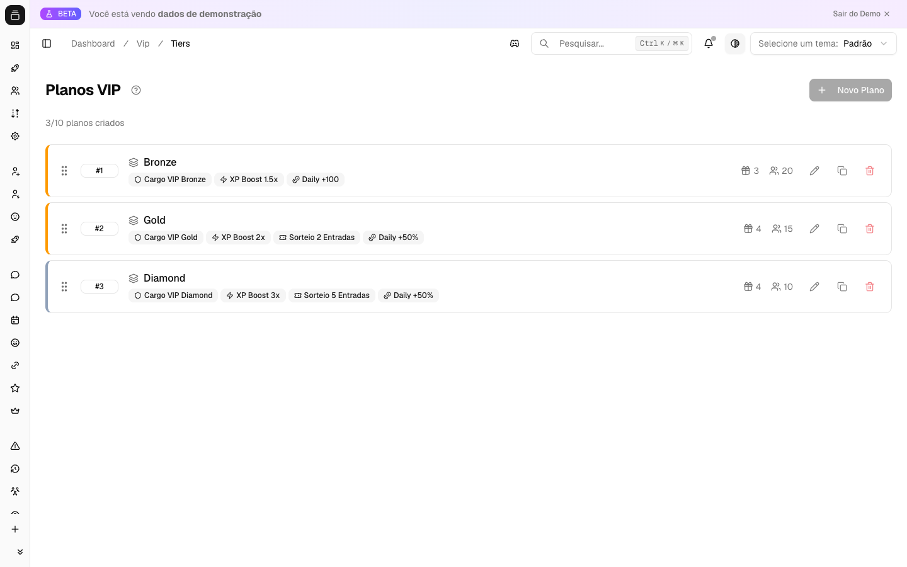

# VIP, assinaturas e recompensas

O sistema VIP do Delfus permite que você crie níveis de assinatura (tiers) com benefícios automáticos — cargos, bônus de XP, mais entradas em sorteios, bônus diário extra e slots de família — e os distribua aos membros por código de resgate ou concessão manual, com expiração e renovação cuidadas pelo bot.

{ .dx-shot loading=lazy }

*Planos VIP no [Dashboard](https://admin.delfus.app) — exemplo com dados de demonstração.*

## Como funciona

O VIP é montado em três peças: **recompensas**, **tiers** e **códigos**. Você cria recompensas (ex.: "Cargo Diamante", "XP 2x"), agrupa elas num tier (nível VIP) e então entrega esse tier aos membros.

1. **Você define os benefícios.** Cada recompensa é de um tipo: cargo (atribui um cargo automaticamente), multiplicador de XP, multiplicador de entradas em sorteios, bônus diário (valor fixo ou percentual) ou slot de família. Um tier junta várias recompensas e tem uma prioridade (quanto maior, mais "alto" o nível).

2. **O membro recebe o VIP.** Isso acontece de duas formas: um administrador concede o VIP manualmente, ou o membro resgata um código com `/vip resgatar`. No resgate, o bot valida o código (existe? expirou? atingiu o limite de usos? o membro já usou?) antes de ativar.

3. **O bot ativa e aplica tudo na hora.** Ao ativar, ele calcula a data de expiração (ou marca como permanente), cria a assinatura, e aplica cada benefício do tier: dá os cargos, libera o bônus de XP, etc. Se configurado, envia um aviso no canal de notificações e uma mensagem privada ao membro.

4. **Upgrade, downgrade e extensão.** Se o membro já tem VIP e ganha um tier de prioridade maior, o bot faz upgrade (cancela o anterior e ativa o novo). Se for o mesmo tier ou um inferior, o bot **estende o tempo** do VIP atual (somando os dias) — desde que a extensão esteja habilitada no servidor.

5. **Avisos de expiração.** De hora em hora o bot verifica quem está perto de perder o VIP e envia uma mensagem privada de aviso (por padrão, 3 dias antes — configurável).

6. **Expiração automática.** Quando o prazo acaba, o bot remove os benefícios: tira os cargos VIP, congela as famílias vinculadas e, se configurado, avisa o membro por DM e no canal.

7. **Reconciliação de cargos.** A cada 6 horas o bot confere se os cargos VIP de cada membro batem com o que ele deveria ter — restaura cargos que sumiram e remove cargos que não deveriam mais estar lá. Isso corrige casos em que alguém removeu o cargo manualmente.

O membro consulta o próprio status com `/vip status` (mostra o tier, quando expira e os benefícios) e vê os níveis disponíveis com `/vip info`.

## Configuração

A maior parte do gerenciamento é feita pelo comando `/vip-admin` (restrito a administradores), organizado em grupos:

- **`/vip-admin reward`** — `create`, `list`, `delete`: gerencia as recompensas (os benefícios).
- **`/vip-admin tier`** — `create`, `list`, `info`, `edit`, `delete`: gerencia os níveis VIP e quais recompensas cada um inclui.
- **`/vip-admin code`** — `create`, `list`, `delete`: gera e gerencia os códigos de resgate (com tier, duração em dias, número máximo de usos e validade opcional).
- **`/vip-admin user`** — `give`, `remove`, `list`, `time`: concede ou retira VIP de um membro e ajusta o tempo da assinatura.
- **`/vip-admin config`** — `channel` (canal de notificações), `dm` (liga/desliga DMs de ativação, aviso e expiração), `expiring-days` (quantos dias antes avisar) e `view` (ver a configuração atual).

Membros usam `/vip status`, `/vip info` e `/vip resgatar`.

As configurações do servidor (canal de notificação, DMs, dias de aviso) também podem ser ajustadas pelo Dashboard em [admin.delfus.app](https://admin.delfus.app); o efeito é o mesmo dos subcomandos de `/vip-admin config`.

Limites por servidor: até 10 tiers, 20 recompensas por tier e 100 códigos ativos.

## Requisitos

- O bot precisa de permissão para **Gerenciar Cargos** e o cargo dele deve estar **acima** dos cargos VIP na hierarquia, para conseguir atribuir e remover esses cargos.
- Para enviar avisos por mensagem privada, o membro precisa aceitar DMs do servidor; se as DMs estiverem fechadas, o bot apenas registra a falha e segue normalmente.
- Recompensas do tipo "família" dependem do módulo de famílias estar em uso no servidor.

!!! tip
    Crie primeiro as recompensas, depois monte os tiers com elas — um tier precisa de pelo menos uma recompensa. Para vender ou distribuir VIP, gere códigos com `/vip-admin code create` definindo a duração e o limite de usos; cada membro só pode resgatar o mesmo código uma vez.
